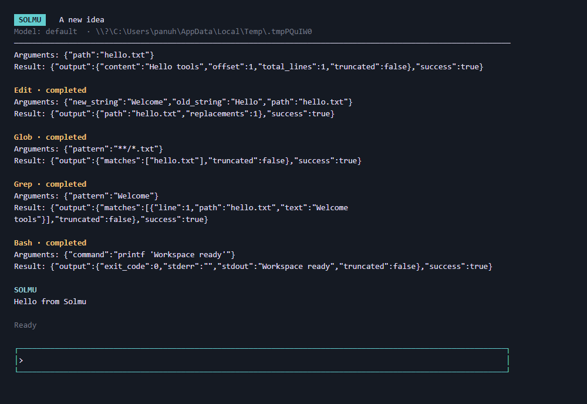
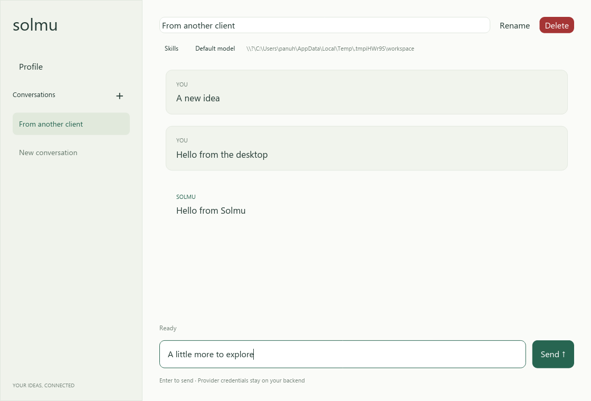

# Solmu

An open-source autonomous agent, taking shape. A Rust backend with terminal,
native desktop, and web clients that share your conversations.

[Website](https://panuhorsmalahti.github.io/solmu/) · [Client guide](docs/clients.md) · [Configuration](docs/configuration.md) · [Releases](https://github.com/panuhorsmalahti/solmu/releases)

- Stream replies from OpenAI, Anthropic, Gemini, and other providers.
- Save conversations locally in SQLite, with automatic thread names.
- Create, open, rename, and delete threads in every client.
- See changes across clients instantly and stop responses anytime.
- Link directly to conversations in the web client.
- Run locally, in Docker, or in a Linux sandbox workspace.
- Run multiple Solmu terminal sessions with workspace switching and split views.

## Install

Linux/macOS:

```sh
curl -fsSL https://raw.githubusercontent.com/panuhorsmalahti/solmu/main/scripts/install.sh | sh
```

Windows PowerShell:

```powershell
irm https://raw.githubusercontent.com/panuhorsmalahti/solmu/main/scripts/install.ps1 | iex
```

Installs the backend, CLI, desktop, sandbox, and muxer from the latest production
release, with checksum verification. **Before the first release, use the source
instructions below.** See [installation options](docs/releases.md).

Create `.env` in your working directory:

```dotenv
LLM_PROVIDER=openai
OPENAI_API_KEY=your-api-key
LLM_MODEL=gpt-6-sol
LLM_TITLE_MODEL=gpt-6-luna
```

Run `solmu-backend`, then `solmu-cli` or `solmu-desktop` in another terminal.
The default backend address is `http://127.0.0.1:3000`.

## From source

Install Rust and Node.js 24 (Node is needed only for the web client).
Copy `.env.example` to `.env` if you have not created it, then fill your key.
From the repository root:

```sh
cargo run -p solmu-backend
```

In another terminal, choose a client:

```sh
cargo run -p solmu-cli
cargo run -p solmu-desktop
```

For the web client:

```sh
npm ci
npm run dev:web
```

Open `http://127.0.0.1:5173`. Provider keys stay on the backend.

## Clients

### Terminal

A Rust TUI with streamed replies, an animated spinner, Tab command completion,
`/threads`, `/open`, `/new`, and `/exit`. Esc or `/stop` cancels a reply.
[Run and use the CLI](clients/cli/README.md).



### Desktop

A native Rust app built with Iced. Select conversations in the left sidebar,
create one with **+**, and stop a response with **Stop**.
[Run and use the desktop client](clients/desktop/README.md).



### Web

React with shadcn/ui. Saved threads, live updates, response controls, and
linkable `/threads/{id}` conversation pages.
[Run and use the web client](clients/web/README.md).


## Muxer

A Rust TUI for multiple real Solmu CLI terminals. Switch workspaces, view two
panes side by side, and track working/idle/error states. Start the backend,
then run `cargo build -p solmu-cli` and `cargo run -p solmu-muxer`.
Press **Ctrl+b n** for a new pane, **Ctrl+b s** to split, and **Ctrl+b q** to quit.
[Run and use muxer](muxer/README.md).


## Docker

```sh
docker run --rm --env-file .env -p 127.0.0.1:3000:3000 \
  -v solmu-data:/data ghcr.io/panuhorsmalahti/solmu:latest
```

Or build with `docker build -t solmu .` and use `solmu` as the image name.
The volume keeps conversations across container restarts.
[Docker setup](docs/running.md).

## Sandbox

The Rust `sandbox` launcher starts Solmu or another program. All network
requests are allowed. On Linux, `--isolated --cwd /path/to/project` gives it
private processes and a filesystem view with only the workspace writable,
filtered system calls, dropped capabilities, and CPU/memory/task limits.
[Permissions and setup](docs/sandbox.md).

## Development

The backend exposes REST APIs, SSE responses, and WebSocket notifications.
All clients have scoped end-to-end tests. GitHub Actions builds, lints, and tests
on Linux, Windows, and macOS, publishes the website and Docker image, and offers
an explicit manual production release workflow.

[API](docs/api.md) · [Build and test](docs/development.md) · [Release workflow](docs/releases.md)
