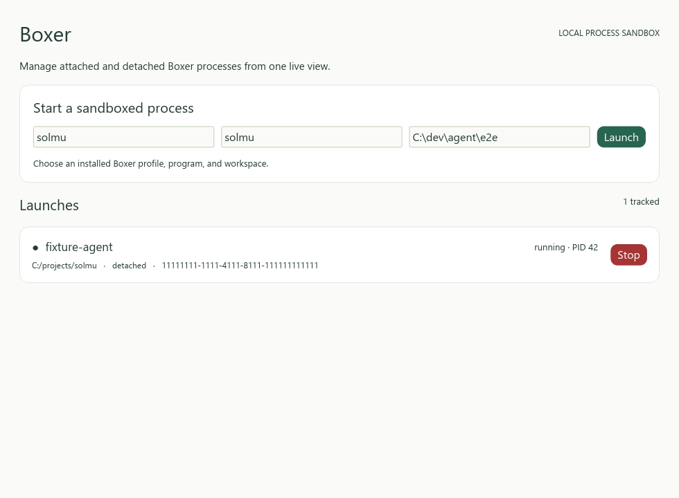

# Boxer GUI



Boxer GUI is a native Rust app for launching and managing Boxer processes.
Install [Boxer](../boxer/README.md#install) first. Both apps can share the same
session directory while running at the same time.

## Install

Linux or macOS:

```sh
curl -fsSL https://raw.githubusercontent.com/panuhorsmalahti/solmu/main/scripts/install-boxer-gui.sh | sh
boxer-gui
```

Windows PowerShell:

```powershell
irm https://raw.githubusercontent.com/panuhorsmalahti/solmu/main/scripts/install-boxer-gui.ps1 | iex
boxer-gui
```

The GUI and CLI share profiles, the `boxer` executable, and local launch
records. Both can run at the same time. The GUI watches the session directory
for filesystem events and refreshes the list when a record changes; it does not
poll. It reads current records once at startup to include changes made while it
was closed. Use the profile, program, and workspace fields to start a process,
then use **Stop** to end a running launch.

For local development, see the [Boxer GUI guide](../docs/boxer-gui.md).
