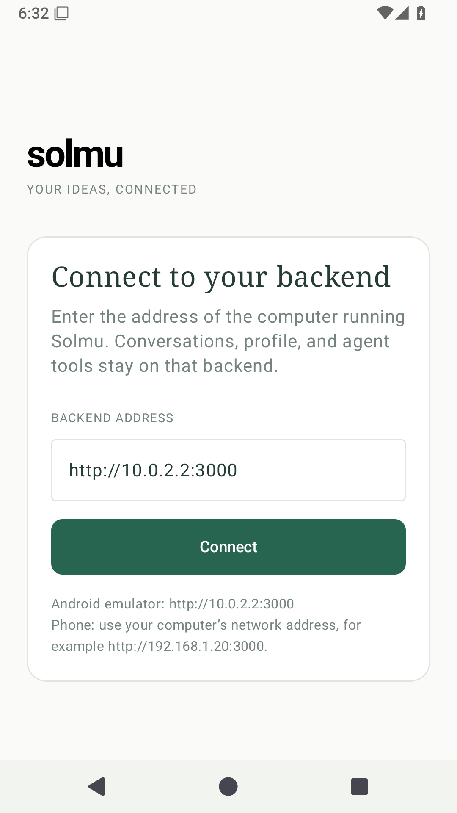

# Solmu Android

Solmu for Android is a native Kotlin and Jetpack Compose app. It talks directly
to the Solmu backend; it does not wrap the web client.

## Build and run

Open this folder in Android Studio, select the `app` run configuration, and
launch it on an emulator or Android device. The backend must already be running.

For an emulator, the app starts with `http://10.0.2.2:3000`. On a phone, enter
the computer's LAN address, for example `http://192.168.1.20:3000`. The backend
must listen on that interface. See the [Android setup guide](../../docs/android.md)
for the network settings and security details.

To install a published build, download the separately packaged
`solmu-v<version>-android.apk` from [GitHub Releases](https://github.com/panuhorsmalahti/solmu/releases),
open it on the device, and approve installation if Android prompts you. The APK
is signed for updates across releases; Android signing setup is documented in
[release and installation docs](../../docs/releases.md#install).

The app shares threads, Profile settings, tool history, tasks, webhooks, skills,
MCP connections, and plugins with the other Solmu clients. Its interface uses
native Android controls, streams responses, and updates from backend events.

## Use

Select a conversation from the top menu or tap **+** to start one. Write a
message and tap the send icon; tap **Stop** while Solmu is replying. The
conversation menu includes rename, model selection, compaction, copy, export,
status, context, and delete. Use the bottom navigation for Profile, Audit,
Tasks, and workspace settings.

