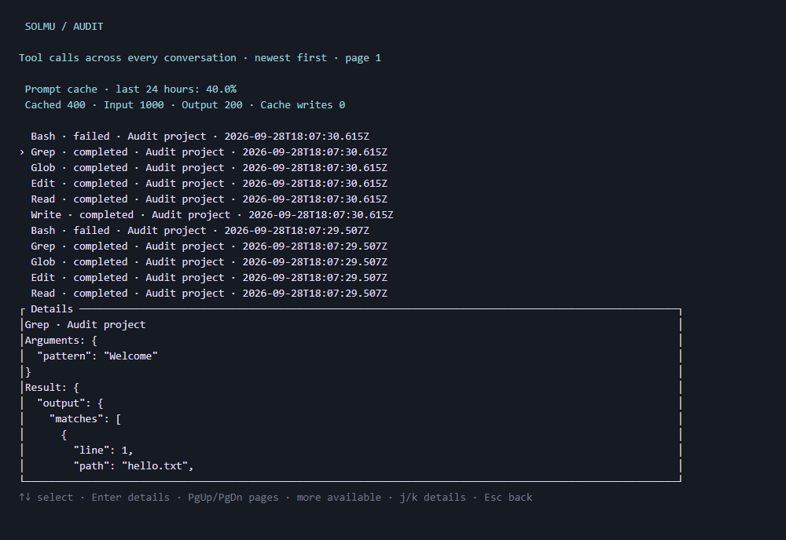
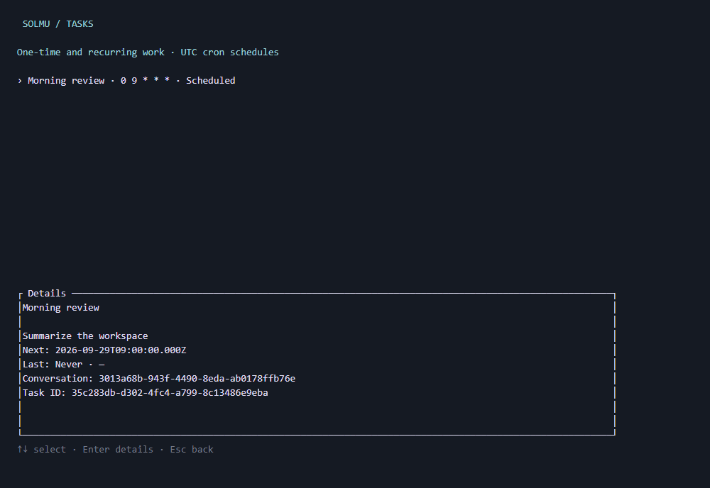
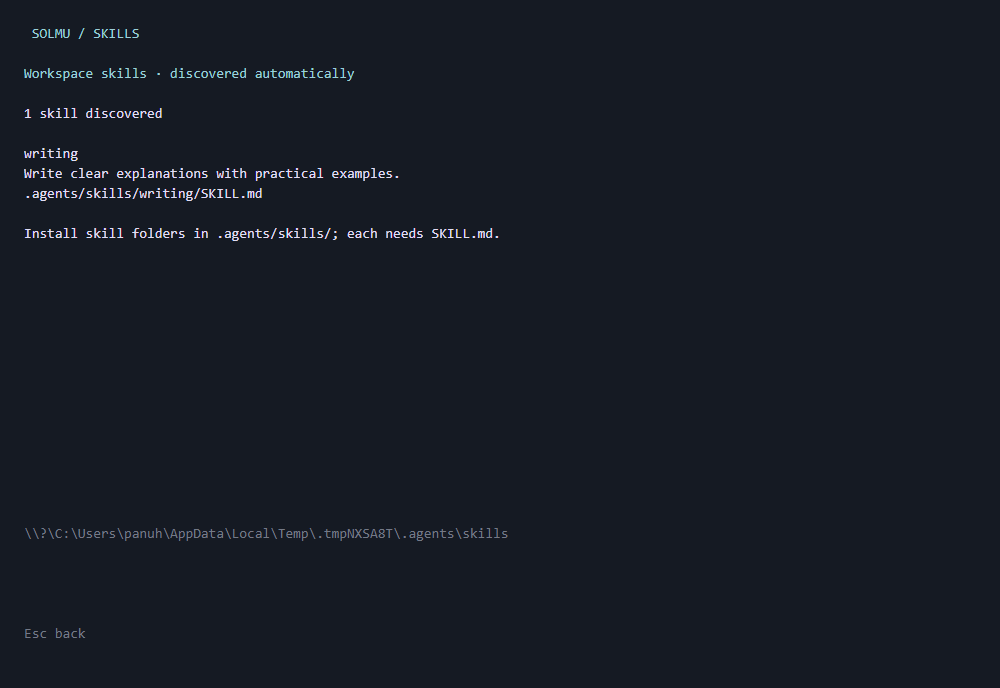

# Solmu CLI

A Rust terminal interface for Solmu. Launch into a new or existing saved conversation.

## Install

Linux/macOS:

```sh
curl -fsSL https://raw.githubusercontent.com/panuhorsmalahti/solmu/main/scripts/install-cli.sh | sh
```

Windows PowerShell:

```powershell
irm https://raw.githubusercontent.com/panuhorsmalahti/solmu/main/scripts/install-cli.ps1 | iex
```

Installs `solmu` from the latest release. Use an existing backend, or
[install the backend separately](../../docs/releases.md#individual-components).
Rerun the same command to update the CLI manually. Installed modules update automatically each day by default; see [update settings](../../docs/configuration.md).

## Run

Assuming the backend is already running and the installed command is on PATH:

```sh
solmu
```

The default backend is `http://127.0.0.1:3000`. Set `SOLMU_BACKEND_URL` in `.env`
or your shell to connect elsewhere. Provider keys belong to the backend.

Use `solmu --thread <id>` to reopen a conversation without creating another.
Find IDs with `/threads`.
`solmu --help` shows startup options; `--version` shows the installed version.

## Use

Type a message and press Enter. Replies appear as they stream and are saved
when complete. PageUp and PageDown scroll the conversation.
Ctrl+L redraws the screen and preserves your unsent input.
An animated spinner indicates that Solmu is working. Type a command prefix
such as `/ren` and press Tab to complete it. Repeated Tab cycles matching commands.
Typing `/` shows the command list. Use Up/Down to choose and Enter to select.

| Command | Action |
| --- | --- |
| `/new [title]` | Start another conversation. |
| `/threads` | List saved conversations with their IDs. |
| `/open <id>` | Open a saved conversation and its history. |
| `/profile` | Edit the shared system prompt and optional default model; see its last edit time. |
| `/model [id\|default]` | Pick a thread model, set an ID, or restore the default. |
| `/rename <title>` | Rename the current conversation. |
| `/delete` | Delete the current conversation and its messages. |
| `/help` | Show commands. |
| `/stop` | Cancel the current response. Esc also stops it. |
| `/exit` | Exit. Ctrl+C also exits. |
| `/plugins` | List installed Agent Plugins and loading errors. |
| `/audit` | Browse saved tool calls across conversations. |
| `/tasks` | Browse scheduled tasks. |
| `/task` | Create and manage scheduled tasks; see [task commands](../../docs/tasks.md). |

Wait for a reply to finish before sending again or changing conversations.
`/exit` still works during streaming. Errors are shown above the input; user
messages remain saved after provider failures or cancellation. Conversations
update automatically when another client changes them.

New threads use your current working folder. `/new` reuses an empty thread until
you send a message. In Profile, Tab switches fields, Ctrl+S saves, Ctrl+U clears,
and Esc returns. The empty Model field shows the actual backend default.

See [CLI usage](../../docs/cli.md), [configuration](../../docs/configuration.md),
and [Docker instructions](../../docs/running.md).
For source builds, see [development](../../docs/development.md).


## Audit

Run `/audit` to inspect the [tool call timeline](../../docs/audit.md). Enter
expands a call; PageUp and PageDown browse older pages.



## Scheduled tasks

Use `/tasks` to browse work scheduled for later. `/task once` and `/task cron`
create tasks; `/task run|pause|resume|edit|delete|runs` manages them. See
[scheduled tasks](../../docs/tasks.md) for examples.



## Skills

Use `/skills` to see installed [workspace skills](../../docs/skills.md).
They are discovered automatically from `.agents/skills/`.



## Workspace tools

Solmu can read, edit, and search files and run Bash commands in the thread's
workspace. Tool activity and results appear live and stay in conversation history.
Stop cancels pending work. See [tools](../../docs/tools.md) for usage and limits.

## MCP tools

Run `/mcp` to see connected MCP servers, their tools, and any setup errors. [Connect a server](../../docs/mcp.md).

## Plugins

Run `/plugins` to see installed [Agent Plugins](../../docs/plugins.md). They can
provide both skills and MCP tools.


