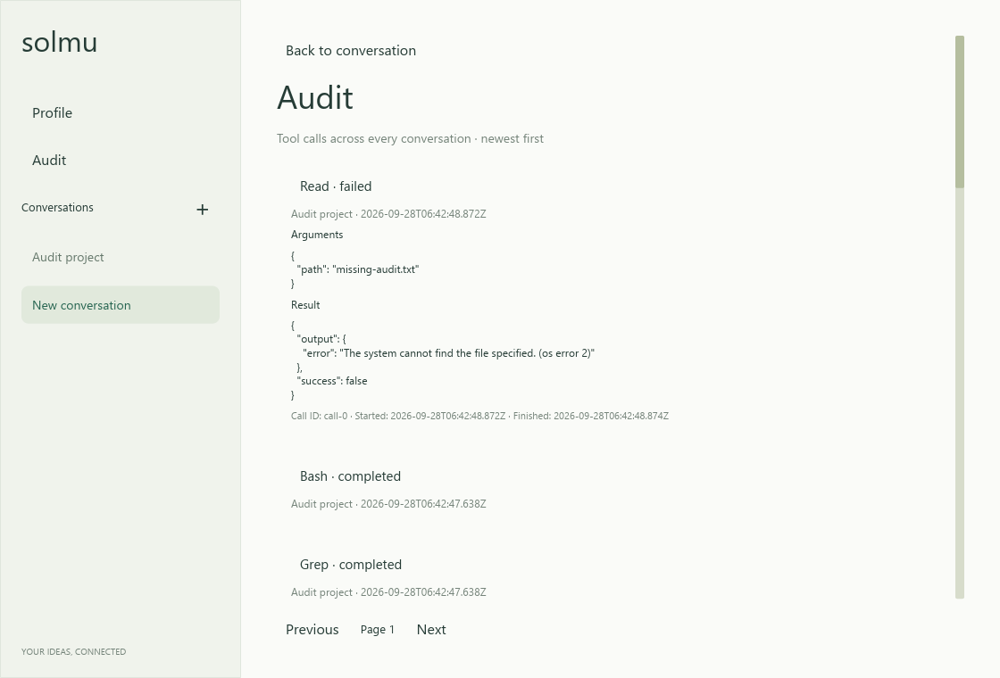
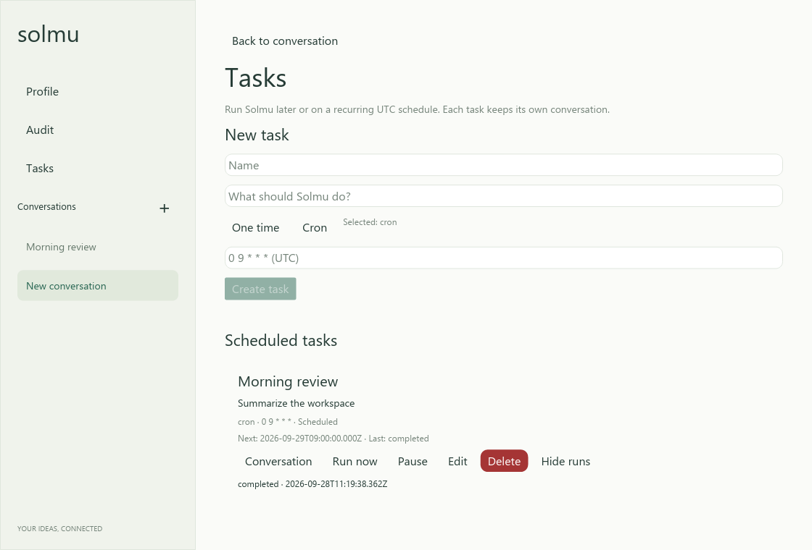
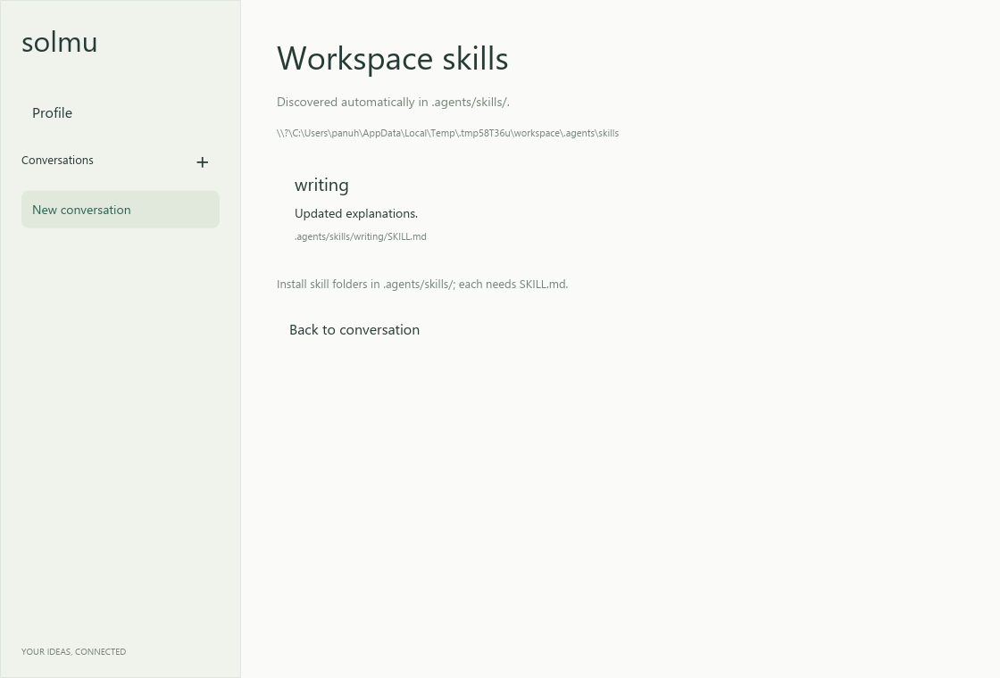
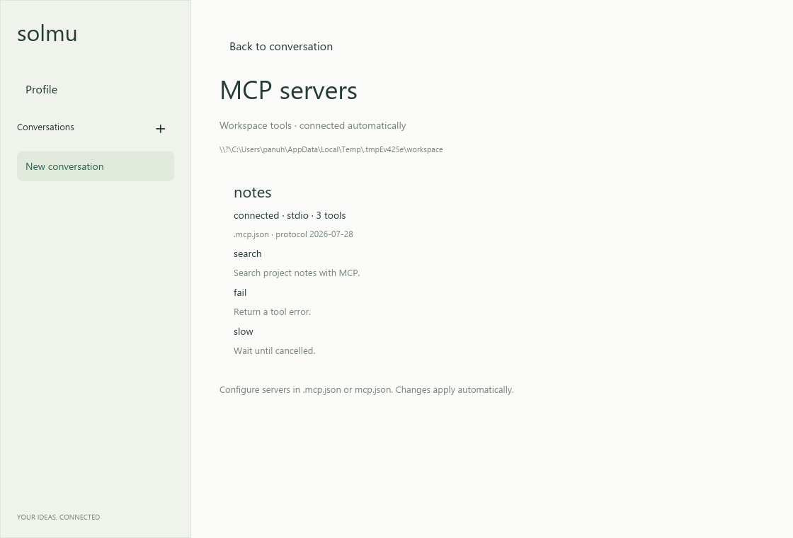
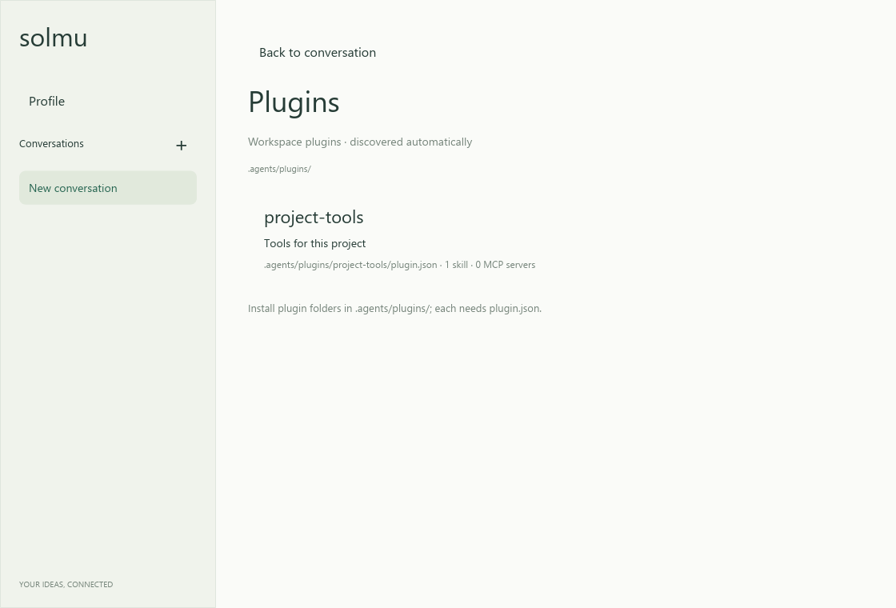

# Solmu desktop

A native Rust desktop client built with Iced.

## Install

Linux/macOS:

```sh
curl -fsSL https://raw.githubusercontent.com/panuhorsmalahti/solmu/main/scripts/install-desktop.sh | sh
```

Windows PowerShell:

```powershell
irm https://raw.githubusercontent.com/panuhorsmalahti/solmu/main/scripts/install-desktop.ps1 | iex
```

Installs `solmu-desktop` from the latest release. Use an existing backend, or
[install the backend separately](../../docs/releases.md#individual-components).

## Run

Assuming the backend is already running and the installed command is on PATH:

```sh
solmu-desktop
```

The desktop client connects
to `http://127.0.0.1:3000`, or the address in `SOLMU_BACKEND_URL`.

## Use

The app creates a new conversation on startup. Use the **+** icon in the left
sidebar for another thread, or select an existing thread to resume its history.
Edit the title and click **Rename**, or **Delete** to remove a conversation.
Type a message and press Enter or **Send**; replies appear as they stream.
Use **Stop** while waiting to cancel a response. Conversations update live
when another client changes them. Errors appear above
the message input. Close the window to exit; conversations remain saved.

Open **Profile** above Conversations to edit the system prompt and optional
default model, and see when the prompt was last edited. An empty Model field
shows the backend default. Use the conversation's model button to pick a model
for that thread. Repeated **+** clicks reuse the empty thread until you send a
message. See [Profile](../../docs/profile.md) and [workspaces](../../docs/workspaces.md).

See [desktop usage](../../docs/desktop.md) and [configuration](../../docs/configuration.md).
For source builds, see [development](../../docs/development.md).


## Audit

Choose **Audit** below Profile to browse [saved tool calls](../../docs/audit.md)
across conversations. Expand a call for details and page through older calls.



## Scheduled tasks

Choose **Tasks** in the sidebar to schedule work once or repeatedly, manage it,
and inspect its run history. See [scheduled tasks](../../docs/tasks.md).



## Skills

Choose **Skills** to see installed [workspace skills](../../docs/skills.md).
They are discovered automatically from `.agents/skills/`.



## Workspace tools

Solmu can read, edit, and search files and run Bash commands in the thread's
workspace. Tool activity and results appear live and stay in conversation history.
Stop cancels pending work. See [tools](../../docs/tools.md) for usage and limits.

## MCP tools

Choose **MCP** in a conversation to see connected servers and their tools. [Connect a server](../../docs/mcp.md).



## Plugins

Choose **Plugins** to inspect installed [Agent Plugins](../../docs/plugins.md)
and loading errors. The list updates automatically.


