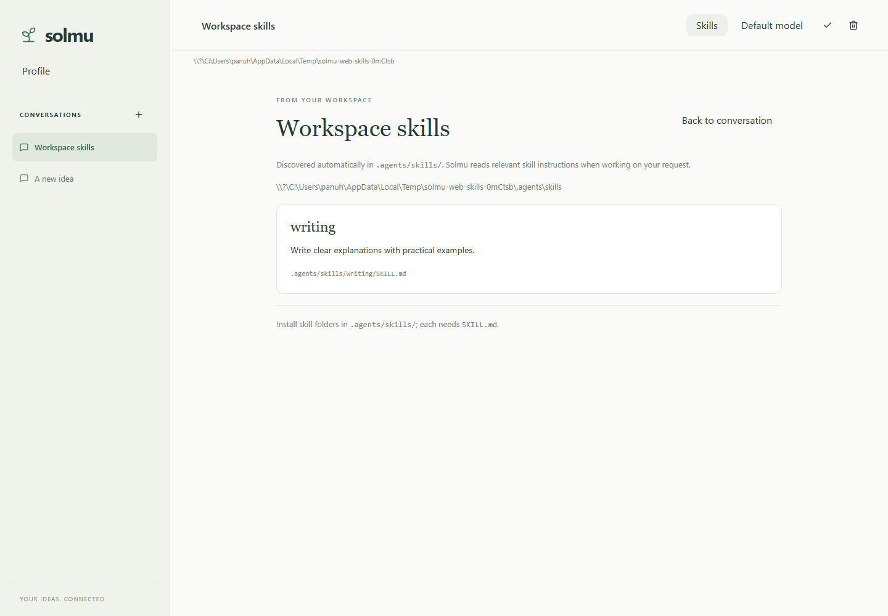

# Solmu web

A React and TypeScript client with shadcn/ui components.

## Install

Linux/macOS (requires `unzip`):

```sh
curl -fsSL https://raw.githubusercontent.com/panuhorsmalahti/solmu/main/scripts/install-web.sh | sh
```

Windows PowerShell:

```powershell
irm https://raw.githubusercontent.com/panuhorsmalahti/solmu/main/scripts/install-web.ps1 | iex
```

Downloads and verifies the published site files into `~/.solmu/web`
(Windows: `%USERPROFILE%\.solmu\web`). This installs only the web client.
Rerun to update it; existing browser tabs keep their previous assets.

## Run

With the backend already running, open **http://127.0.0.1:3000**.
The backend serves the installed web client, API, streaming replies, and
WebSocket updates on the same port. No separate web server is needed.
Provider keys stay on the backend.

For another installation folder, set `SOLMU_INSTALL_DIR` and configure the
backend's `SOLMU_WEB_DIR` to match. See [web setup](../../docs/web.md).

## Use

Select a thread in the left sidebar to load its history. Click the **+** icon
to create a new thread. Edit the title and click the check icon to rename it;
the trash icon deletes the thread and its messages.

Type a message and press Enter or the send arrow. Shift+Enter adds a new line.
Replies stream as they arrive. Threads get an automatic name after the first
message unless you chose a name manually. Changes from other clients appear
automatically over WebSockets. **Stop** cancels a response. Each conversation
has a linkable `/threads/{id}` URL. Errors appear above the composer.

**Profile**, above Conversations, or clicking **solmu** opens `/profile`.
Edit the shared system prompt and optional default model, and see the prompt's
last edit time. An empty Model field shows the actual backend default. Use the
conversation's model button to choose a model for that thread. Repeated **+**
clicks reuse the empty thread until you send a message. Profile updates appear
automatically and preserve unsaved edits. See [Profile](../../docs/profile.md).

See [web usage](../../docs/web.md).
For source builds, see [development](../../docs/development.md).


## Audit

Choose **Audit** below Profile, or open `/audit`, to browse
[saved tool calls](../../docs/audit.md). Expand a call for details and scroll to
load older calls.


## Scheduled tasks

Choose **Tasks** in the sidebar or open `/tasks` to schedule work, manage tasks,
and inspect run history. See [scheduled tasks](../../docs/tasks.md).


## Skills

Choose **Skills** to see installed [workspace skills](../../docs/skills.md).
They are discovered automatically from `.agents/skills/`.



## Workspace tools

Solmu can read, edit, and search files and run Bash commands in the thread's
workspace. Tool activity and results appear live and stay in conversation history.
Stop cancels pending work. See [tools](../../docs/tools.md) for usage and limits.

## MCP tools

Choose **MCP** in a conversation to see connected servers and their tools. [Connect a server](../../docs/mcp.md).


## Plugins

Choose **Plugins** to inspect installed [Agent Plugins](../../docs/plugins.md)
and loading errors. The list updates automatically.


