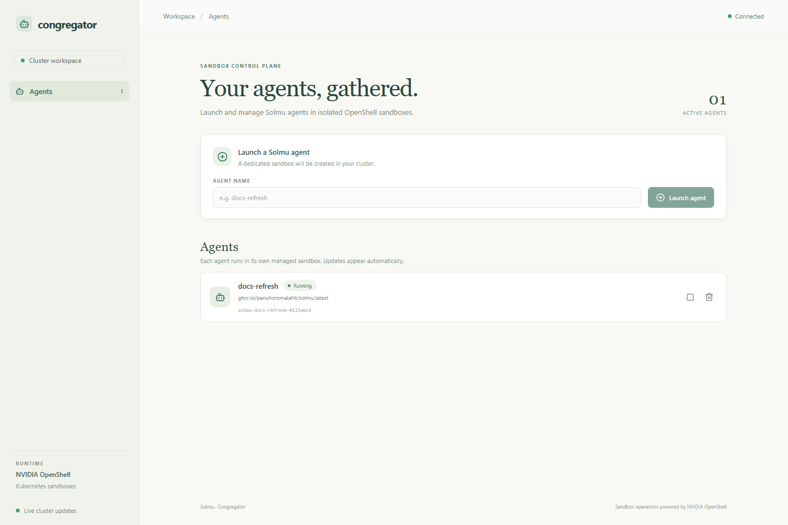

# Congregator

Congregator is Solmu's cloud control plane for managing Solmu agents in
Kubernetes. It creates, lists, stops, starts, and deletes agent sandboxes, and
shows their status in a web dashboard. NVIDIA OpenShell provides the sandbox
runtime; its Kubernetes driver provisions each sandbox workload through the
Kubernetes Agent Sandbox controller.

The REST API and web dashboard are served by one Rust service. The dashboard
updates automatically while it is open and reconnects to the current agent list
when you return to the page.



## Install into a cluster

Congregator is installed separately from the local Solmu backend and clients.
It requires Kubernetes 1.29 or newer, Helm 3, and access to the GitHub Container
Registry.

First install the Agent Sandbox controller and then NVIDIA OpenShell. OpenShell
documents the current setup and the requirements for its gateway and sandbox
workloads in its [Kubernetes installation guide](https://docs.nvidia.com/openshell/latest/kubernetes/setup).
The Rust SDK used by Congregator supports gateway HTTPS with a private CA and
optional OIDC bearer token, but not mTLS client certificates. Configure the
OpenShell gateway for HTTPS without client mTLS; configure OIDC and provide a
service token when gateway authorization is enabled.

Clone the Solmu repository, then install its chart:

```sh
git clone https://github.com/panuhorsmalahti/solmu.git
cd solmu
helm upgrade --install congregator \
  ./cloud/congregator/chart \
  --namespace congregator --create-namespace \
  --set openshell.gatewayUrl=https://openshell.openshell.svc.cluster.local:8080
```

For an OIDC protected OpenShell gateway, create a Kubernetes Secret containing
the service token and pass its name:

```sh
kubectl -n congregator create secret generic openshell-access \
  --from-literal=token="$OPENSHELL_TOKEN"
```

Then include `--set openshell.tokenSecretName=openshell-access`. The default
chart values trust the CA certificate in the OpenShell `openshell-server-tls`
Secret. Override `openshell.caSecretName` and `openshell.caSecretKey` when your
cluster uses another Secret.

The service is `ClusterIP` by default. Use an ingress or port-forward to open
the dashboard. Congregator has no user login yet, so only expose the dashboard
to people allowed to create and delete agent sandboxes.

Each agent starts the Solmu backend in its sandbox and exposes its HTTP service
through OpenShell. Configure an LLM provider in OpenShell and, if needed, set
`agent.openShellProvider` to its provider name. The chart's default agent image
is the published Solmu container image. Override it with `agent.image` if you
publish a custom Solmu image.

## Configuration

| Setting | Default | Purpose |
| --- | --- | --- |
| `openshell.gatewayUrl` | `https://openshell.openshell.svc.cluster.local:8080` | OpenShell's in-cluster gateway endpoint |
| `openshell.tokenSecretName` | unset | Kubernetes Secret containing an OpenShell OIDC token under `token` |
| `openshell.caSecretName` | `openshell-server-tls` | Secret holding the gateway CA certificate |
| `agent.image` | `ghcr.io/panuhorsmalahti/solmu:latest` | Container image launched in each sandbox |
| `agent.openShellProvider` | unset | Optional OpenShell provider attached to every Solmu sandbox |
| `image.repository` | `ghcr.io/panuhorsmalahti/solmu-congregator` | Congregator server image |
| `ingress.enabled` | `false` | Create an Ingress for the dashboard and REST API |

## REST API

The service exposes:

| Method | Path | Purpose |
| --- | --- | --- |
| `GET` | `/api/v1/agents` | List Congregator-managed agents |
| `POST` | `/api/v1/agents` | Create an agent with `{ "name": "docs-refresh" }` |
| `GET` | `/api/v1/agents/{sandbox-name}` | Get one managed agent |
| `POST` | `/api/v1/agents/{sandbox-name}/stop` | Stop its sandbox |
| `POST` | `/api/v1/agents/{sandbox-name}/start` | Start its sandbox |
| `DELETE` | `/api/v1/agents/{sandbox-name}` | Delete the agent and sandbox |
| `GET` | `/healthz` | Readiness and liveness probe |

Congregator only lists and mutates sandboxes carrying its managed label, so it
does not take over unrelated OpenShell sandboxes.
