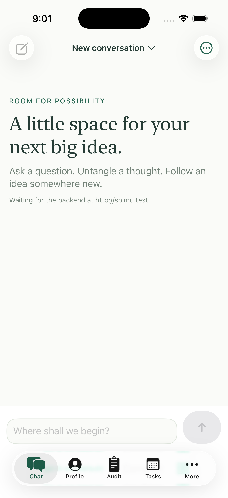

# iOS

Solmu for iOS is a native SwiftUI client. It connects directly to the backend;
it does not display the web client inside a browser view. Threads and Profile
are shared with every other client, and streamed replies arrive over the same
backend API.

## Connect

On the same Mac as the backend, use `http://127.0.0.1:3000`. On an iPhone,
enter the Mac's LAN address, such as `http://192.168.1.20:3000`. The app
remembers this address on the device.

For an iPhone to reach a backend on your Mac, set `SOLMU_BIND_ADDR=0.0.0.0:3000`
for the backend service and allow that port through the Mac firewall. The
backend currently has no login, so only expose it to a network you trust. The
default `127.0.0.1:3000` binding remains local to the computer.

## Use

Choose or create conversations from Chat. Replies stream as Solmu works, and
Stop cancels a pending response. Conversation actions include rename, model
selection, compaction, copy, export, status, context, and delete. Profile edits
the shared prompt and optional default model. Audit pages through saved tool
calls and shows the prompt-cache hit rate for the last 24 hours. Tasks creates,
edits, runs, pauses, and removes one-shot or cron schedules. More includes
webhook management and the current workspace's Skills, MCP servers, and
Plugins. Backend events keep the open views current after changes and reconnects.
Enter `/goal <objective>` in chat to start a persistent goal, or `/goal` to
list saved goals. See [Goals](goals.md).

## Build

Building and running the app requires macOS with Xcode. In `clients/ios`, install
XcodeGen and generate the Xcode project:

```sh
brew install xcodegen
xcodegen generate --spec project.yml
open Solmu.xcodeproj
```

Select the **Solmu** scheme and an iPhone simulator or device. The GitHub Actions
workflow builds and runs the native end-to-end tests on a macOS simulator. See
[development](development.md) for other client test commands.

## Screenshot


