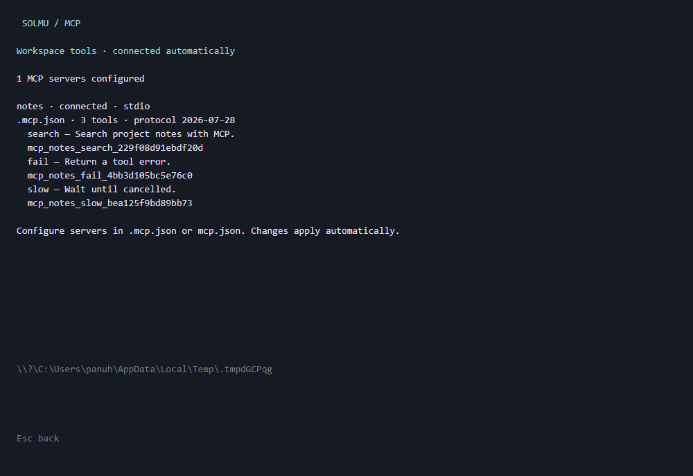

# MCP tools

Connect Solmu to local or remote MCP servers to give the agent additional tools.
Servers belong to a conversation's workspace. Solmu discovers configuration
automatically when opening a conversation or starting a reply; no backend restart
is needed.

## Configure servers

Create `.mcp.json` in your workspace:

```json
{
  "mcpServers": {
    "project-tools": {
      "command": "your-mcp-server",
      "args": ["--stdio"],
      "env": { "SERVICE_TOKEN": "${env:SERVICE_TOKEN}" }
    },
    "remote-tools": {
      "type": "http",
      "url": "https://your-server.example/mcp",
      "headers": { "Authorization": "Bearer ${env:SERVICE_TOKEN}" }
    }
  }
}
```

Replace the examples with your server's command, arguments, endpoint, and
credentials. Commands run from the workspace on the **backend's machine**, using
its PATH and permissions. They execute directly without an implicit shell. On
Windows, use an executable, or explicitly invoke `cmd.exe` with `/c` for a `.cmd`
launcher. Local commands inherit the backend environment, with `env` overrides.
Place only trusted server configurations in a workspace: enabling a command
starts that program, and enabled tools can be called automatically by the agent.

Solmu supports these workspace files, in increasing priority:

1. `.vscode/mcp.json`
2. `.cursor/mcp.json`
3. `mcp.json`
4. `.mcp.json`

Both `mcpServers` and VS Code's `servers` object are accepted. Files are merged;
a higher-priority entry replaces a server with the same configured name.
Configuration files must remain inside their workspace. Other workspaces and
global client configuration files are not loaded into this conversation.

Use `${env:NAME}` or `${NAME}` to reference the backend's environment, including
values loaded from its `.env`. Missing variables appear as configuration issues;
Solmu does not silently substitute empty credentials. Keep secrets out of Git.
URLs cannot contain embedded credentials; use `headers`. Protocol headers cannot
be overridden. Credentials, arguments, and full endpoint URLs are not exposed by
the status API.

Add `"disabled": true` to a server to stop its connection and remove its tools.
Editing or removing configuration takes effect automatically. Healthy servers
remain usable when another server has an invalid configuration or cannot connect.
Failed servers reconnect automatically. Discovery is limited to 32 servers,
256 tools per server, and 1 MB per configuration file.

## Transports and protocol

Solmu uses the official Rust MCP SDK and targets
[MCP 2026-07-28](https://modelcontextprotocol.io/specification/2026-07-28):

- **stdio:** a configured `command` with optional `args` and `env`.
- **Streamable HTTP:** a configured HTTP(S) `url` with optional `headers`.
  Both JSON and request-scoped SSE responses are supported. HTTPS certificates
  are verified, and redirects are not followed.

Modern servers use discovery, per-request metadata, and standard HTTP routing
headers. Older stdio and Streamable HTTP servers are supported through legacy
initialization and session negotiation. The deprecated standalone HTTP+SSE
transport is not supported; migrate those servers to Streamable HTTP.

This integration exposes **tools**. Separate resource/prompt browsers, OAuth
login flows, server-initiated sampling, interactive elicitation, and the tasks
extension are not enabled or advertised. Authenticated HTTP servers can use
configured authorization headers. A server requesting unsupported interactive
input receives a failed tool result; Solmu never invents a user answer.

## See status and use tools

- **CLI:** `/mcp` shows servers, connection status, protocol version, available
  tools, and configuration issues. Tab completes the command; Esc returns.
- **Desktop and web:** choose **MCP** in a conversation to see the same status.
- **Muxer:** use `/mcp` in a Solmu pane.

Status and tool lists update automatically, including after reconnecting, while
preserving unsent drafts. Tool names are prefixed with `mcp_` and include a stable
server/tool identifier, so servers can expose identically named tools without
replacing each other or Solmu's built-in tools.

The model receives connected tool definitions automatically with each reply.
MCP servers bundled in [Agent Plugins](plugins.md) load alongside workspace MCP
servers. Plugin packages use their own `mcp.json` format and location.
Calls appear in the existing tool activity view and are saved with their
arguments, results, and status. Text, structured data, and other MCP content
blocks are preserved in the result JSON; private result `_meta` is omitted.
Server-reported `isError` results are failures. **Stop** cancels an in-flight MCP
request; calls also time out after 60 seconds and are never automatically retried.
Cancellation is cooperative: a remote server may already have performed an action.
Results larger than 1 MB fail rather than entering model context.

`GET /api/v1/threads/{id}/mcp` returns `workspace`, loaded `files`, `servers`, and
configuration `issues`. Server entries contain `name`, `source`, `transport`,
`status`, `protocol_version`, `tools`, and `error`. Unknown threads return 404.
WebSocket events use `{ "type": "mcp_changed", "thread_id": "..." }` when status
or tools change. Clients fetch the catalog again on that event and reconnect.




