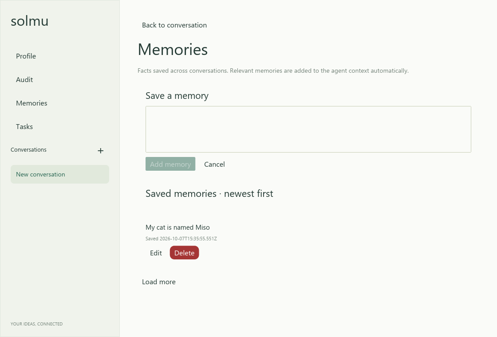
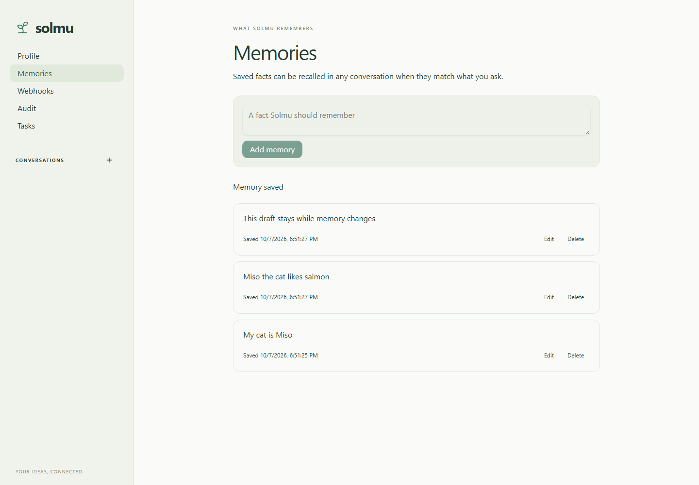

# Memories

Memories are durable facts shared across conversations and stored in Solmu's
SQLite database. The agent can search, read, write, update, and delete them with
its `Memory` tool. It saves a memory when you ask or clearly expect something to
be remembered, and checks for duplicates before writing.

Before a reply, Solmu compares words in your latest message with saved memory
text. Up to five matching entries are added to the request's system context,
ordered by relevance. This lightweight matching helps with direct topics such
as asking about cats when a saved fact mentions your cat. It does not send every
memory with every request. Memory text is treated as user-provided facts, not
instructions.

## Browse and manage

The **Memories** page lists entries from newest to oldest and loads another page
as you scroll. Each entry shows when it was first saved; editing also updates its
last-modified timestamp. You can add, edit, and delete entries from web and
desktop. CLI, Android, and iOS provide a read-only memory list. The list updates
when another client changes memories.

- **Web:** open **Memories** in the sidebar or visit `/memories`.
- **Desktop:** choose **Memories** in the sidebar, or enter `/memories`.
- **CLI:** enter `/memories`; PageDown loads older entries.
- **Android and iOS:** open **More → Memories**.
- **Muxer:** enter `/memories` in a Solmu pane.

Memories are shared for the backend installation. Deleting a memory removes it
from future prompts. Existing conversation messages and summaries are not
rewritten.

## Screenshots

### CLI

### Desktop

### Web

