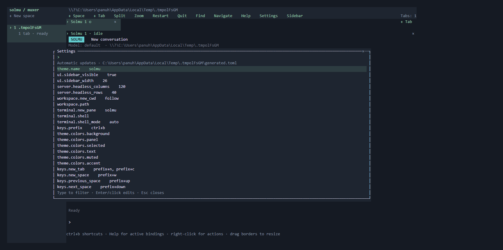

# Muxer settings

Open **Settings** from Muxer's toolbar, its pane menu, or **Ctrl+b ,**.
Click **solmu / muxer** in the sidebar to open Settings in a narrow terminal.
Type to filter settings, then Enter or click a row to edit it. Enter or **Save**
applies the value; Esc or **Cancel** keeps the previous value.

Settings use `config.toml` in Muxer's state directory:
`~/.solmu/muxer/config.toml`, or `%USERPROFILE%\.solmu\muxer\config.toml` on Windows.
`SOLMU_MUXER_DIR` changes that directory. Set `SOLMU_MUXER_CONFIG` to use another
configuration file; relative paths resolve from your launching directory.
Set this before starting a session. An existing server continues using the
configuration file it started with. Named sessions share the default file.

**File edits apply automatically**, usually within a second. No restart is
needed. Removing the file restores defaults. Invalid edits keep the last working
configuration and show an error; invalid startup configuration uses defaults.
Unknown settings, conflicting shortcuts, and out-of-range values are rejected.
Correct the file and the error clears automatically.

Other attached terminals see saved settings automatically. Filters, unsaved
setting edits, rename drafts, and CLI input remain intact. Settings preserve
comments and merge unrelated changes made by another terminal. If the same
setting changed while you were editing it, your draft remains open: cancel and
open the setting again to review the current value. Settings do not replace an
invalid configuration file; fix the file first.

## Create a configuration file

Settings creates the file when you first save a value. To start with a commented
configuration covering every supported shortcut:

```sh
mkdir -p ~/.solmu/muxer
muxer --default-config > ~/.solmu/muxer/config.toml
```

PowerShell:

```powershell
New-Item -ItemType Directory -Force "$env:USERPROFILE\.solmu\muxer" | Out-Null
muxer --default-config | Set-Content -Encoding utf8 "$env:USERPROFILE\.solmu\muxer\config.toml"
```

The file must be UTF-8; a UTF-8 BOM is supported. Files can contain up to 64 KiB.
You can edit the file directly or use Settings for individual values.

## Shortcuts

Use `[keys]` to change the prefix or any action's shortcuts:

```toml
[keys]
prefix = "ctrl+a"
new_tab = ["prefix+n", "ctrl+alt+n"]
find = "prefix+g"
rename_pane = "prefix+shift+p"
```

Press the prefix, release it, then press the rest of a `prefix+…` shortcut.
Direct chords such as `ctrl+alt+n` work without a prefix. An override replaces
that action's default shortcuts. Use an array to keep multiple shortcuts, or
`[]` to unbind an action. Mouse controls remain available for unbound actions.
In Settings, enter a comma-separated list; clearing the field unbinds the action.

**Help** always shows the active shortcuts, including overrides and unbound
actions. Navigation mode uses the configured prefix shortcuts without their
prefix. Enter, Esc, or an unmodified `q` returns typing to the CLI.
Text-editing fields retain their editing shortcuts.

Supported modifiers are `ctrl`, `alt`, `shift`, and `super`. Keys include single
characters, arrows, `tab`, `backtab`, `enter`, `esc`, `home`, `end`, `pageup`,
`pagedown`, `backspace`, `delete`, `insert`, and `f1`–`f24`. Use `plus`, `minus`,
`comma`, `slash`, `backslash`, or `space` when a character would be ambiguous.
Uppercase ASCII letters also mean Shift. Your terminal and operating system must
deliver the configured chord to Muxer.

The prefix must be modified or use an Escape, function, or navigation key.
Conflicting shortcuts are rejected; change both actions or unbind one first.
`send_prefix` sends the configured prefix key to the focused CLI.

| Action names | Purpose |
| --- | --- |
| `new_space`, `new_tab` | Create a project space or Solmu tab |
| `previous_space`, `next_space` | Switch spaces |
| `previous_tab`, `next_tab`, `select_tab_1`–`select_tab_8` | Switch tabs |
| `split_right`, `split_down` | Split the focused pane |
| `focus_left`, `focus_down`, `focus_up`, `focus_right` | Focus neighboring panes |
| `swap_left`, `swap_down`, `swap_up`, `swap_right` | Exchange pane positions |
| `zoom` | Zoom or restore the layout |
| `close_pane`, `close_tab`, `close_space` | Close and stop owned CLIs |
| `rename_space`, `rename_tab`, `rename_pane` | Edit a layout name |
| `find`, `navigate`, `help`, `settings` | Search, navigation, shortcuts, and settings |
| `resize_or_restart`, `restart` | Resize a running pane or restart an exited pane |
| `detach`, `send_prefix`, `toggle_sidebar` | Detach/quit, send the prefix, or toggle the sidebar |

## Colors and sidebar

```toml
[theme]
name = "light"

[theme.colors]
accent = "#266c42"

[ui]
sidebar_visible = true
sidebar_width = 30
```

Themes are `solmu` (a deep green dark palette), `light`, and `terminal`
(your terminal's ANSI palette).
Override `background`, `panel`, `selected`, `text`, `muted`, or `accent`.
Colors accept `#RRGGBB`, named ANSI colors (`black`, `white`, `red`, `green`,
`blue`, `yellow`, `cyan`, `magenta`, `gray`, `darkgray`), or `reset`, `default`,
and `transparent`. Clear a color in Settings to use the theme's original color.
Default terminal text/background follow the Muxer theme; explicit colors from
the CLI remain intact.

Sidebar width accepts 10–80 columns and is capped at one third of the terminal.
**Sidebar** or **Ctrl+b B** temporarily toggles visibility for this attached
terminal. Other clients keep their own visibility. A valid configuration change
restores the configured default.

## Working directories and headless size

```toml
[workspace]
new_cwd = "follow"
# For new_cwd = "path", also set:
# path = "/path/to/project"

[server]
headless_columns = 120
headless_rows = 40
```

`workspace.new_cwd` chooses the working folder for new panes and tabs:

| Value | Folder |
| --- | --- |
| `follow` (default) | Focused pane's workspace |
| `current` | Directory where the server was launched |
| `home` | Your home directory |
| `path` | `workspace.path`; relative paths resolve beside the config file |

These policies also choose the first space in a new session when `--cwd` is
omitted. Explicit `--cwd` and new-space prompts choose their specified folder.
Folders must exist. Set `workspace.path` before choosing `path` in Settings.
Existing threads retain their workspaces; configuration changes affect new work.
Live and restored sessions keep their saved directories even if the configured
directory for new work is missing.

Headless columns accept 20–240; rows accept 8–100. These size the session's
terminals before a UI attaches. Muxer's chrome and split dividers use some of
that area. Attached clients supply their terminal size; shared tabs follow the
last client to interact with them. `muxer pane read ID` keeps visible screen
row breaks, including when no UI is attached.



See [Muxer usage and session recovery](muxer.md).

[Shell and command panes](muxer-commands.md) run local terminals and project commands beside
Solmu. New-pane defaults apply automatically; saved commands wait for explicit
restart after the server restarts.

Set `worktrees.directory` in `config.toml` to choose where Muxer creates branch
checkouts. See [Git worktrees](muxer-worktrees.md).
