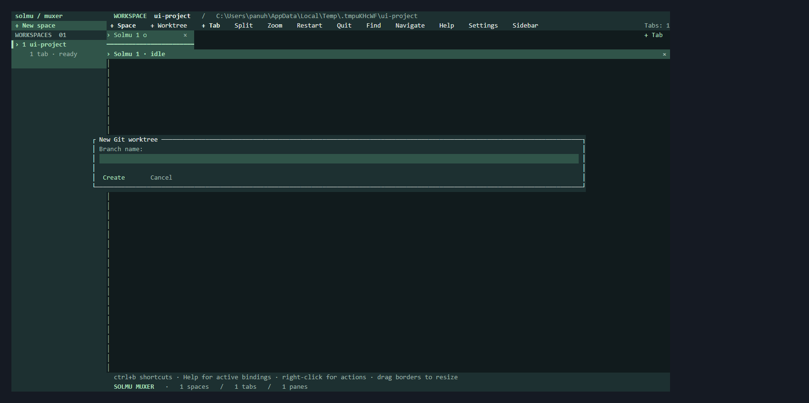

# Git worktrees in Muxer

Create a separate checkout for a branch and open it as a new Muxer space.
The source project remains in its existing space; each worktree gets its own
Solmu conversation and tabs.

## Create from the TUI

Select a space inside a Git repository. Choose **+ Worktree** from the toolbar,
or press **Ctrl+b**, then **Shift+G**. Enter a branch name and submit. Muxer
creates the branch from `HEAD`, checks out the worktree, and opens its space.
If that local branch already exists, Muxer checks it out instead.

The created worktree appears as a normal space, labeled with the repository and
branch. Closing the space leaves its checkout and branch on disk.

## Create from Muxer GUI

Open the **+** menu beside **Spaces**, enter a branch in **New worktree branch**,
and choose **Create worktree**. It uses the selected project's Git repository
and focuses the new Solmu space.

## Create from scripts

```sh
muxer worktree create --space 1 --branch feature/review --base main --focus
```

`--space` defaults to the selected space. `--base` is used when Muxer needs to
create a new branch; if the branch already exists locally, Git checks it out
and ignores `--base`. `--path` selects an explicit absolute checkout path.
Without it, Muxer creates `<worktrees.directory>/<repository>/<branch-slug>`.
The command returns the new space, tab, pane, branch, and path as JSON.

Configure the destination root in Muxer's `config.toml`:

```toml
[worktrees]
directory = "~/.solmu/muxer/worktrees"
```

Relative paths resolve from the configuration file. Muxer asks Git to create
and manage the checkout; it does not delete worktree directories when a space
is closed. Select a closed worktree's path with **+ Space** to open it again.


