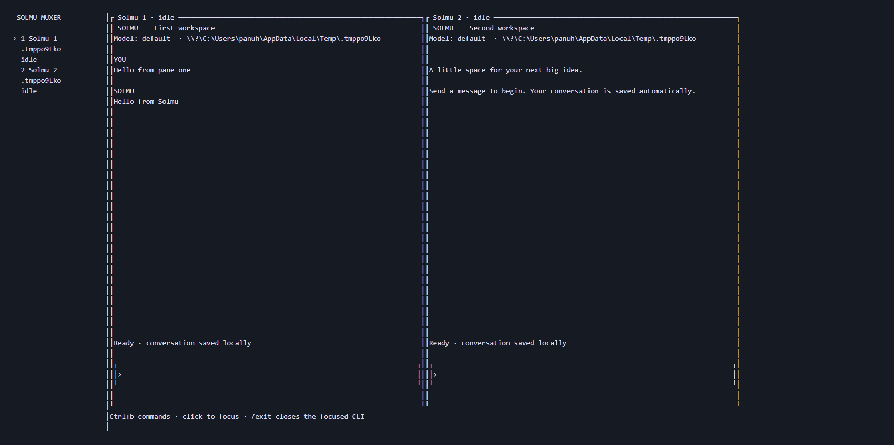
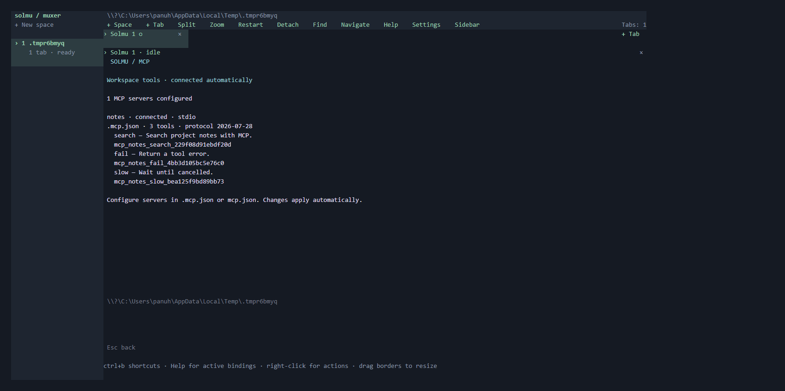

# Solmu muxer

Use `/skills` in a Solmu pane to list its workspace's installed
[skills](skills.md). The catalog updates automatically.

Muxer groups **real Solmu CLI terminals** into spaces on Linux, macOS, and
Windows. Each space is a working directory and can hold up to eight tabs;
up to eight spaces can be open. Each tab holds up to eight real terminal panes
in a nested layout. Every pane starts its own conversation and keeps running
while you switch tabs or spaces. The sidebar shows spaces and their tab counts;
tabs show activity, and each terminal shows its status.

With the backend already running, launch the installed Muxer from your project
folder. See [installation](../muxer/README.md#install):

```sh
muxer
```

Installed releases provide the `muxer` command. Select initial workspaces with
one or more `--cwd PATH` options; paths containing spaces must be quoted:

```sh
muxer --cwd /path/to/project --cwd "/path/to/another project"
```

The default workspace is your working directory. **Ctrl+b w** opens a path
prompt for a new space; Enter or **Create** starts its first tab and Esc or
**Cancel** dismisses it. Directories must already exist. **Ctrl+b n** or **+ Tab**
starts another tab in the current space. New tabs are selected automatically.

Click a sidebar space to switch projects. Each space remembers its selected
tab and each tab remembers its focused pane. Click a tab to select its layout,
or its **×** icon to close and terminate all its CLIs. Closing a background tab
preserves the current tab. Closing a space's last tab removes the space;
closing the final tab ends that session. Saved conversations remain in the backend.
Toolbar buttons also create spaces/tabs, open split actions, zoom the focused
pane, restart an exited CLI, detach, find another pane, or open navigation and help.

Split a pane **right** or **down** to start another Solmu conversation in the
same workspace. Splits can be nested. Click any visible terminal to focus it;
only the focused pane receives typing. Right-click a pane for split, zoom,
resize, close, and restart actions. Its header's **×** closes just that pane;
the remaining layout expands to fill the gap.

Right-click a **space**, **tab**, or **pane** to rename it. Names are shared
with other attached terminals and saved across session restarts. They label
Muxer's layout; `/rename` inside a CLI still changes its conversation title.
Names can contain up to 80 characters. Save an empty name to restore the default.
Custom pane headers retain their numeric ID, such as `Planner #2`.
Space menus also create tabs or close the entire space. Closing a space stops
its panes without deleting project files or saved conversations.

**Find** or **Ctrl+b g** opens a searchable list of spaces, tabs, and panes.
Search names, workspace paths, and pane states; several words narrow the results.
Use Up/Down or Tab to select, then Enter or a mouse click to open it. Esc or **×** cancels.
The list updates automatically as other terminals change the session.

**Navigate** or **Ctrl+b m** enters navigation mode: `h/j/k/l` focuses panes,
Up/Down switches spaces, and Tab switches tabs without another prefix. Other
Muxer shortcuts work in this mode too, including `g` for Find and `?` for help.
Enter, Esc, `q`, or another click on **Navigate** returns typing to the CLI.
**Help** or **Ctrl+b ?** shows a searchable shortcut list. Typing in navigation,
help, search, or naming dialogs is kept out of the conversation.

Naming, workspace, and search fields support editing at the cursor: Left/Right
move by Unicode grapheme, Home/End move to either end, Alt+B/F or Ctrl+Left/Right
move by word, and Backspace/Delete remove the adjacent grapheme. Ctrl+U/K cuts
before/after the cursor, Ctrl+W cuts the previous word, Alt+D cuts the next word,
and Ctrl+Y inserts the field's last cut text. Paste inserts at the cursor;
line breaks are removed. Long fields scroll horizontally. Each attached
terminal keeps its own search and unsaved drafts during live updates.
Ctrl+B/F, Ctrl+A/E, and Ctrl+H/D also move by grapheme, move to either end,
and delete the previous/next grapheme respectively.

Drag a divider to resize its adjacent panes. **Ctrl+b r** enters keyboard
resizing for a running pane: arrows or `h/j/k/l` adjust its nearest divider
by five percent; Enter or Esc finishes. **Ctrl+b z** zooms a pane to fill the
tab, and repeats to restore its layout. Terminal dimensions follow resizing
and view changes; tab strips keep the selected tab visible in narrow windows.

## Controls

Press **Ctrl+b**, release it, then press the second key:

| Second key | Action |
| --- | --- |
| `n` | New Solmu tab in the current space |
| `w` | New space path prompt |
| Up / Down | Previous / next space |
| Tab or `]` | Next tab in the space |
| Shift+Tab or `[` | Previous tab in the space |
| `1`–`8` | Select a tab by its position within the space |
| `s` or `v` | Split the focused pane to the right |
| `-` | Split the focused pane down |
| `h/j/k/l` | Focus the pane to the left/down/up/right |
| `H/J/K/L` | Swap the focused pane with its neighbor |
| Left / Right | Focus a horizontal neighbor; Shift swaps it |
| `z` | Zoom the focused pane or restore the layout |
| `x` | Close and terminate the focused pane |
| `X` | Close the selected tab and all its panes |
| `D` | Close the selected space and all its tabs |
| `W` / `T` / `P` | Rename the space / tab / pane |
| `g` | Find spaces, tabs, and panes |
| `m` | Enter or leave navigation mode |
| `?` | Search keyboard help |
| `,` | Open Settings |
| `B` | Show or hide the sidebar for this client |
| `r` | Resize a running pane; restart an exited CLI with a new conversation |
| `q` | Detach from the session; its CLIs keep running |
| `b` | Send a literal Ctrl+b to the selected CLI |

Use all [CLI conversation commands](cli.md) inside a pane: send messages,
receive streaming replies, create/open/rename/delete threads, complete commands
with Tab, stop with Esc or `/stop`, and quit that CLI with `/exit`. Enter pressed
during a finishing conversation operation or live refresh is preserved until
the CLI is ready. Saved conversations and WebSocket updates are shared with
desktop and web too. `/profile` edits the shared system prompt and optional
default model; `/model` selects a model for the current thread. Tabs use their
space's directory as the thread workspace.

Scripts can [send prompts directly to Solmu](muxer-agents.md), queue tasks,
wait for an individual saved reply, and cancel active and queued work.
Terminal drafts and unsaved Profile edits remain intact. Pane headers show
the number of unsent queued prompts.

## Configuration and lifetime

**Settings** edits colors, shortcuts, sidebar presentation, working-directory
policies, and headless dimensions. File changes apply automatically and preserve
drafts. **Help** shows your current bindings. See [Muxer settings](muxer-configuration.md)
for the configuration file, all action names, and examples.

`SOLMU_BACKEND_URL` defaults to `http://127.0.0.1:3000`. Muxer loads `.env`
from its working directory; existing environment variables take precedence.
Provider keys stay on the backend. Muxer finds `solmu` beside its own
executable, then on PATH. Set `SOLMU_CLI_PATH` to an absolute Solmu CLI path
if installed elsewhere.

Muxer supports **Solmu only**. Running `muxer` starts or attaches to your
**default local background session**. **Detach** or **Ctrl+b q** closes only
the attached UI: its panes keep running, including streaming replies. Closing
the terminal also leaves the session running. Run `muxer` again to reattach
to the same live terminals and conversations.

Use named sessions for separate groups of projects:

```sh
muxer session attach work
muxer --session side-project --cwd /path/to/project
muxer session list
muxer server status --session work
muxer server stop --session work
muxer pane read 1 --session work
```

`muxer server start --session work` starts a session without opening a UI.
`--cwd` options set initial spaces for a new session; existing or restored
sessions use their saved spaces. Add more projects with **+ Space** after attaching.
Session names accept letters, digits, underscores, and hyphens (up to 64 characters).
`muxer pane read ID` prints the live pane's visible terminal text, including
when no UI is attached. Pane IDs appear in terminal headers. This command reads
the current screen; it does not create a conversation or send input.

Several terminals can attach to one session. Each remembers its own selected
space, tab, pane, and zoom. Shared layout changes appear automatically in all
clients. When clients view different tabs, each tab follows its viewer's size.
When they share a tab, the last client to interact controls its pane dimensions;
other clients display as much as fits in their terminal.

Stop the default session and its CLIs with `muxer server stop`. `/exit` leaves
an exited pane visible so its final contents can be read or restarted. Saved
conversations remain available after stopping. For a temporary session whose
panes terminate when you quit, use `muxer --foreground`.

Session connection state and error logs live under `~/.solmu/muxer`
(`%USERPROFILE%\.solmu\muxer` on Windows); `SOLMU_MUXER_DIR` overrides that
directory. Keep it private to your account. The server listens only on localhost
and authenticates clients using a per-session token.

## Local automation

Use `muxer api snapshot` to inspect a session and `muxer space`, `tab`, or `pane`
commands to create, name, focus, arrange, close, and restart terminals. Scripts
can send text/keys and read real pane screens while detached. See
[Muxer automation](muxer-automation.md) for commands, JSON results, stable IDs,
and selecting a particular attached terminal. Event subscriptions send live
snapshots, and state/output waits coordinate scripts without polling the CLI.

## Restart recovery

Muxer saves each session's spaces, working directories, names, tabs, nested splits,
divider sizes, zoom, and last active pane in `<session>.json` in its state
directory. Closing a tab or pane updates the saved layout. Closing the final
tab ends the session; its next launch starts a new layout.

After a server stop or restart, running Solmu panes reopen their saved
conversations, including message history, tool results, and model selections.
New processes are started: pending replies and commands do not continue across
a server restart. Detaching keeps those original processes alive.
Panes previously closed with `/exit` remain stopped; use **Restart** to start a
new conversation. A missing workspace is shown as unavailable instead of
silently substituting a different working directory.

Only layout and conversation references are written to Muxer's snapshot;
terminal contents and message text are not copied into it. Conversation history
stays in the backend database.

If a snapshot is corrupt or belongs to an unsupported format, Muxer preserves
its original bytes in `backups/` before replacing it with a fresh session.
The latest three recovery copies per session are retained. If preservation
fails, the original snapshot remains untouched; running panes still work.
Recovery details are written to `<session>.log`. To recover a copy, stop that
session, copy the chosen backup over `<session>.json`, and start it again.



## Workspace tools

Solmu can read, edit, and search files and run Bash commands in the thread's
workspace. Tool activity and results appear live and stay in conversation history.
Stop cancels pending work. See [tools](tools.md) for usage and limits.

`muxer server stop` waits for terminal processes to exit and the session lock
to be released, so the same named session can be restarted immediately.

[Direct terminal attachment](muxer-terminals.md) opens one existing pane or streams its
live screen to scripts. Several observers can watch while one controller owns
input and size, with explicit takeover and draft-preserving detach.

[Shell and command panes](muxer-commands.md) run local terminals and project commands beside
Solmu. New-pane defaults apply automatically; saved commands wait for explicit
restart after the server restarts.

## MCP

Use `/mcp` inside a Solmu pane to inspect live workspace server status and available tools. See [MCP setup](mcp.md).


