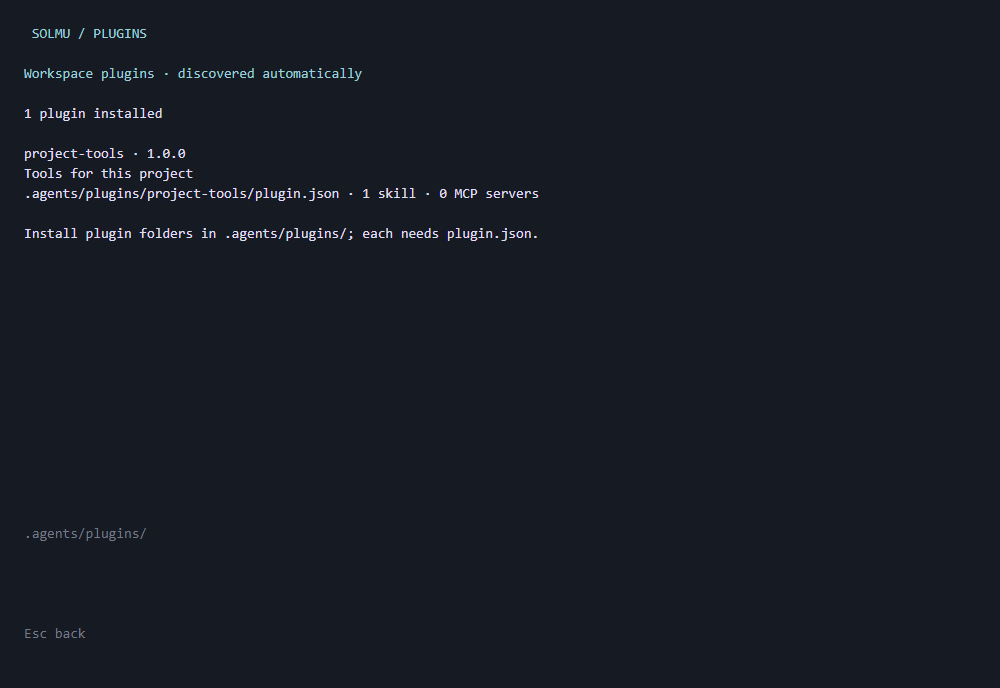

# Agent Plugins

Plugins let a workspace add reusable skills and MCP tools together. Solmu loads
installed plugins automatically for conversations in that workspace.

Place each plugin in `.agents/plugins/<folder>/`. Its root needs a `plugin.json`:

```json
{
  "$schema": "https://agent-plugins.org/schemas/1.0.0/plugin.schema.json",
  "name": "project-tools",
  "description": "Skills and tools for this project"
}
```

Add `skills/<skill-name>/SKILL.md` to provide skills, or `mcp.json` to provide
MCP servers. Both are optional. For an MCP server, use the Agent Plugins MCP
format:

```json
{
  "$schema": "https://agent-plugins.org/schemas/1.0.0/mcp.schema.json",
  "mcpServers": {
    "project-search": {
      "type": "stdio",
      "command": "./bin/project-search"
    }
  }
}
```

Installed skills appear in **Skills** and `/skills`. Plugin MCP connections and
tools appear in **MCP** and `/mcp`. Solmu can use both on its next reply. Open
**Plugins** in desktop or web, or run `/plugins` in CLI or Muxer, to see installed
packages and any loading errors. These lists update automatically when plugin
files change.

Local plugin MCP programs run with the plugin folder as their working directory
by default. They receive `PLUGIN_ROOT` and a persistent `PLUGIN_DATA` directory
at `.solmu/plugin-data/<folder>/`. Remote plugin MCP servers use Streamable HTTP;
remote URLs must use HTTPS. SSE-only plugin servers are not supported. Install
plugins you trust: local MCP servers execute programs with the backend's access.

See the [Agent Plugins specification](https://agent-plugins.org/specification)
for package format details. Solmu reads Agent Plugins 1.0.0 packages from this
workspace location; plugin installation and updates are managed by you.

## Plugins in each client

### Terminal client



### Desktop client


### Web client


### Muxer


