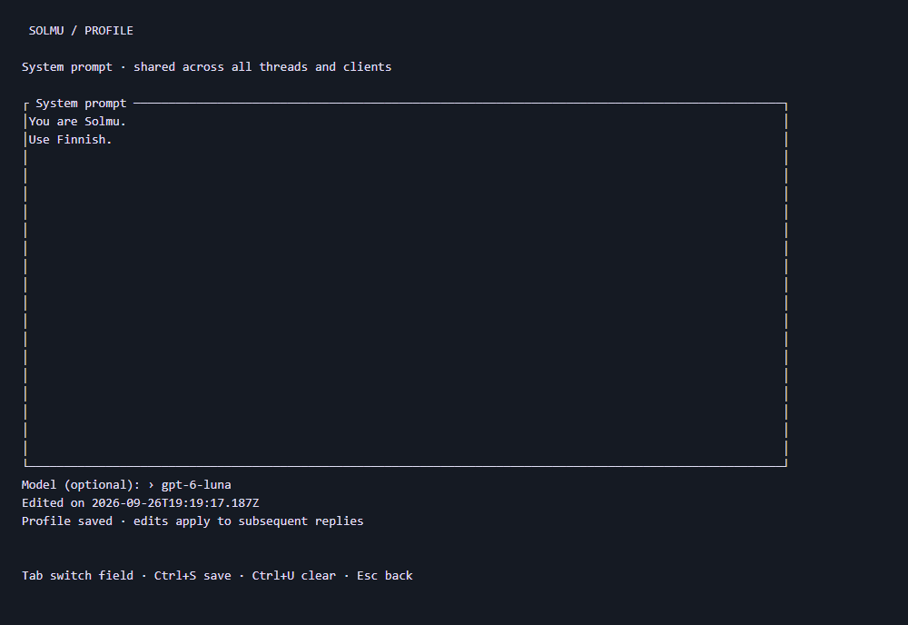
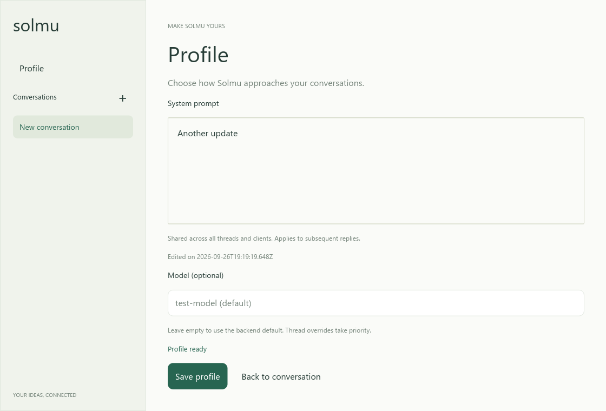
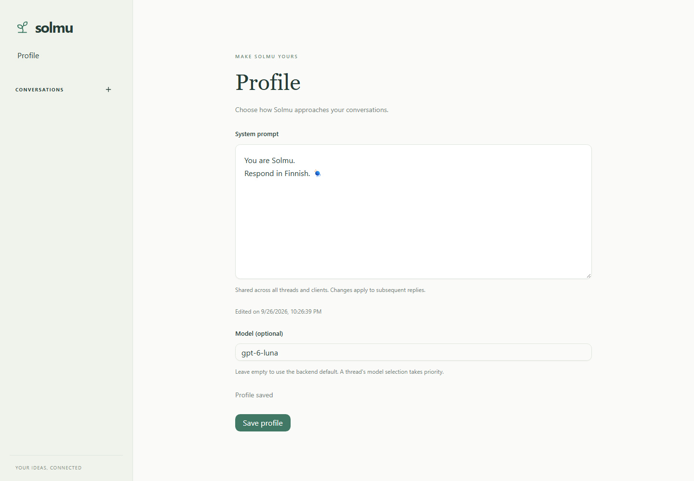

# Profile

Open **Profile** above Conversations in desktop or web. Clicking the Solmu
name in the web sidebar also opens `/profile`. In the terminal, use `/profile`.
Muxer sessions use the same CLI Profile editor.

The page shows your current system prompt. Edit it and save to change how
Solmu responds. Your profile is saved on the backend and shared across all
clients and threads. It starts with “You are Solmu, an autonomous agent.”
Changes apply to subsequent replies; a reply already running keeps its original
settings. Saved messages remain unchanged.

**Model** is optional. Set a model ID to override the backend's default model.
Leave it empty to use `LLM_MODEL` or the provider's automatically selected model.
A thread's own model selection takes priority over Profile.

The empty Model field shows the actual backend default, for example
`gpt-6-sol (default)`. This placeholder is not an override. If no model is
available, it says “No model configured”.

**Edited on** shows when the saved system prompt last changed. Solmu keeps
timestamped versions of the prompt in its database, including the initial
prompt. History is retained across restarts; browsing or restoring versions
is not available yet. Saving identical text or changing only the model does
not create another prompt version or change its edit time. Web shows local
time; the terminal and desktop show UTC.

In the CLI, Tab switches between the prompt and model fields. Ctrl+S saves,
Ctrl+U clears the focused field, and Esc returns to the conversation. The prompt
supports multiple lines, cursor keys, Home, End, Backspace, and Delete.

Changes made elsewhere appear automatically. Unsaved edits are preserved;
you will see a notice if Profile changes while you are editing. There are no
reload controls. The web client retries failed profile loads automatically.

See [model settings](configuration.md) and [client screenshots](clients.md).

## Profile screens

