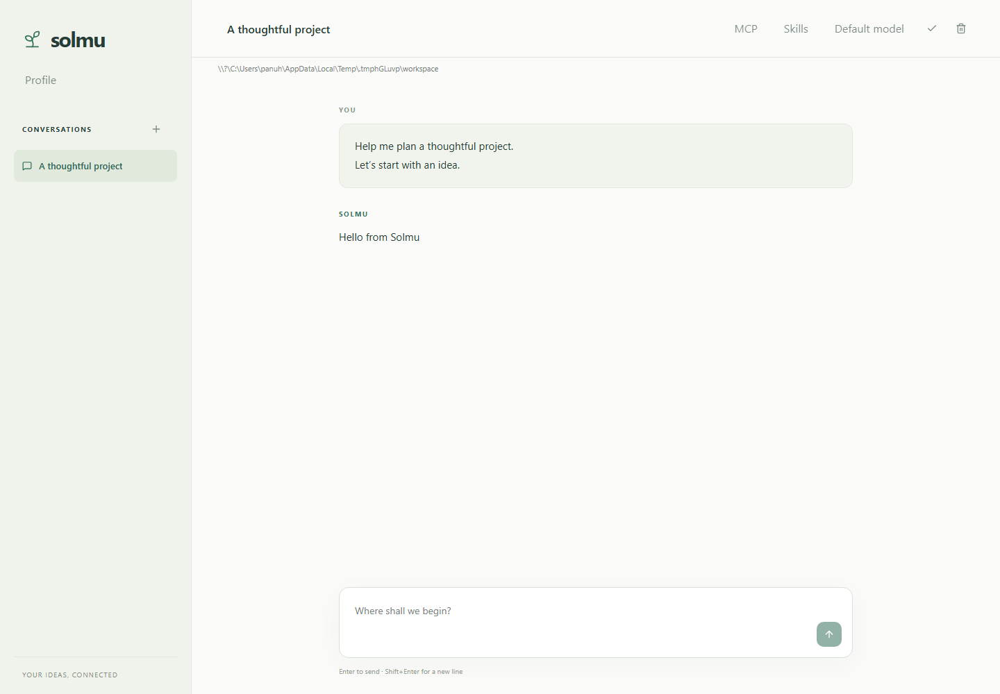
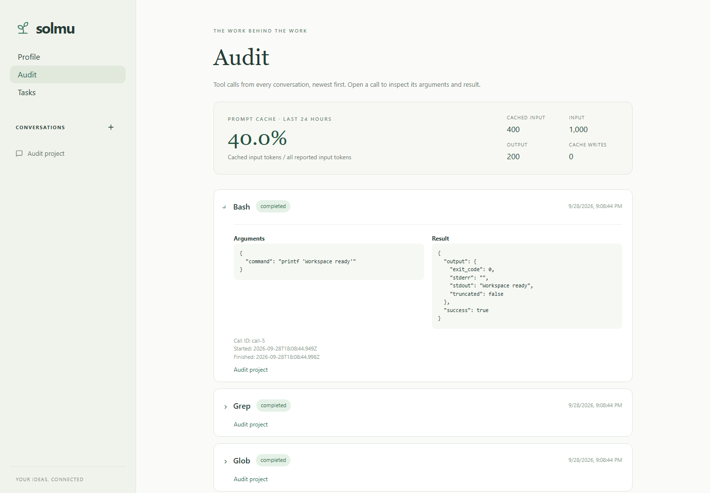
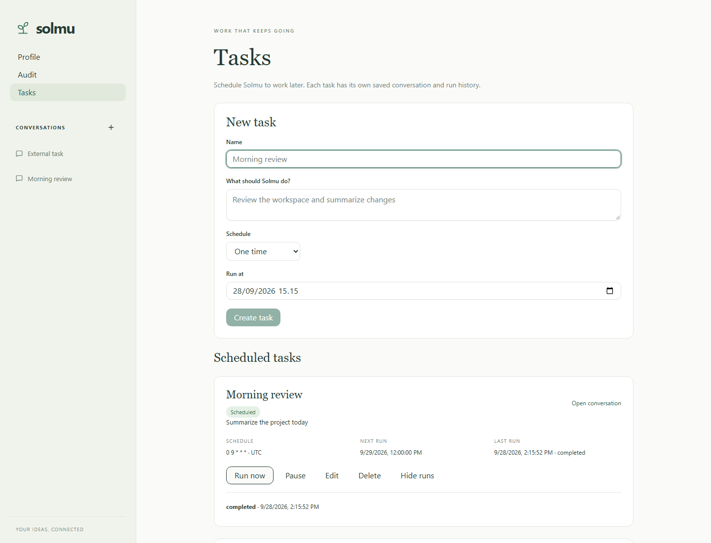
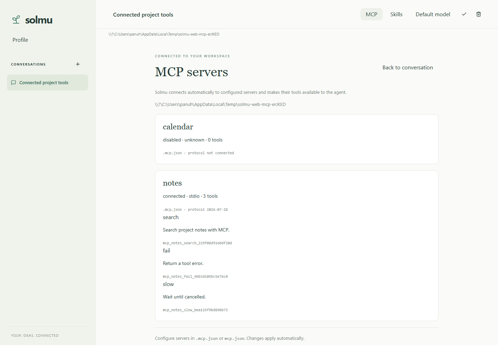
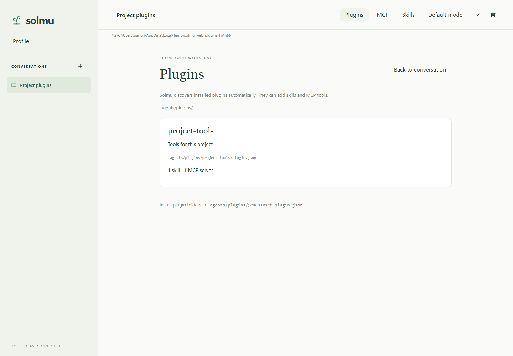

# Web client

## Run the published web client

With the backend already running, use the [web installer](../clients/web/README.md#install)
and open **http://127.0.0.1:3000**. The backend serves the web client directly,
including `/profile` and `/threads/{id}` links, streamed replies, and live
WebSocket updates. No Node.js, Rust, or separate web server is needed.
The [bundle installer](bundle.md) includes both backend and web client.

Site files live in `~/.solmu/web` (Windows: `%USERPROFILE%\.solmu\web`).
The web installer updates its own deployments, preserves previous hashed assets
for open tabs, and replaces the page entry point last. It refuses to overwrite
an unrelated folder. If you choose a different folder with `SOLMU_INSTALL_DIR`,
set the backend's `SOLMU_WEB_DIR` to that folder and restart its
[background service](services.md). Web files installed in the configured folder
become available immediately without restarting the backend.

A backend without installed web files still supports every API and native client;
its web pages return 404 until the web client is installed. Missing assets and
unknown API routes return 404, rather than the web page. Provider keys and the
database are never served as static files. The Docker image includes web files.

The marketing website on GitHub Pages is separate and does not host a backend
or conversations. The local backend has no authentication; keep its default
loopback address unless you provide your own access controls.

## Use

A new conversation is created when opening the root URL. Each thread has a
linkable `/threads/{id}` URL; opening that URL loads the existing conversation.
Browser Back/Forward switches between visited threads. The sidebar lists saved threads;
click a thread to resume it or **+** to create one. The title gets an automatic
name after the first message. Edit it and click the check icon to rename it.
The trash icon deletes the thread and all its messages.

Repeated **+** clicks reuse the current empty conversation until you send a
message. Open **Profile** above Conversations, or click **solmu**, to edit your
shared system prompt and optional default model. The page shows when the prompt
was last edited, and the empty Model field displays the actual backend default.
Use the model button in a conversation to override its model or return to the
default. OpenAI and Anthropic show named choices; custom model IDs also work.
Profile changes appear live while preserving unsaved edits.
See [Profile](profile.md) and [workspaces](workspaces.md).

Use **Webhooks** to connect GitHub or another service. Authenticated JSON events create a conversation and start an agent response in the background. See [Webhooks](webhooks.md) for setup and listener configuration.

Type a message and press Enter or the send arrow. Shift+Enter adds a newline.
Replies stream into the conversation and are saved when complete. Thread
changes and sending are disabled while a reply is processing. Provider errors
appear above the composer; user messages remain saved.

**Stop** cancels the current response, keeping your user message and discarding
the unfinished reply. Changes from other clients and generated titles arrive
automatically over WebSockets, with reconnect after a lost connection.

Choose **Compact** in the conversation controls to replace the visible history
with a continuation summary. Solmu also compacts automatically at an estimated
95% of the selected model's context window.

Use **Status** to see the backend connection, thread, model, and workspace.
**Context** summarizes the messages, tool calls, skills, MCP servers, and
plugins currently loaded for the conversation. The download icon exports the
thread as a Markdown file; the copy icon copies Solmu's latest reply.

For source builds and web development, see [development](development.md).

## Audit

Choose **Audit** below Profile or open `/audit`. Expand a call for arguments and
results; older calls load as you scroll. The list updates automatically. See
[Audit](audit.md).
The page also shows the last 24 hours' prompt cache hit rate and token counts.

## Scheduled tasks

Choose **Tasks** in the sidebar or open `/tasks`. Create a one-time or recurring
task, edit or pause it, run it now, see its run history, and open its saved
conversation. The page updates automatically while preserving your form draft.
See [scheduled tasks](tasks.md).

## Workspace tools

Solmu can read, edit, and search files and run Bash commands in the thread's
workspace. Tool activity and results appear live and stay in conversation history.
Stop cancels pending work. See [tools](tools.md) for usage and limits.

## Skills

Choose **Skills** in the conversation controls to see the workspace's installed
[skills](skills.md). The list updates automatically and preserves your draft.

## MCP

Open **MCP** in a conversation to see live server status and tools while keeping your unsent draft. See [MCP setup](mcp.md).

## Plugins

Open **Plugins** to inspect installed [Agent Plugins](plugins.md) and loading
errors. Your unsent draft is preserved and the list updates automatically.

