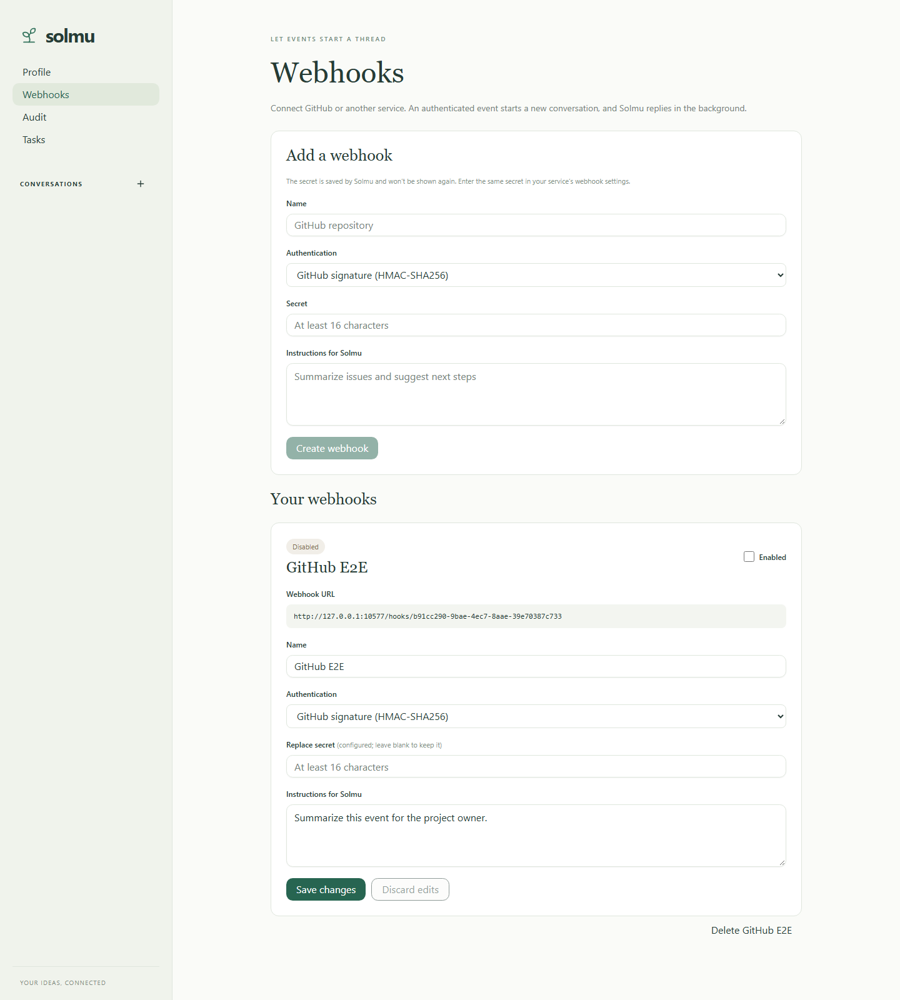

# Webhooks

Webhooks let GitHub or another service start a Solmu conversation. Solmu saves the incoming event as the first user message and starts an agent response in the background. Each delivery creates its own conversation.

## Set up a webhook

Open **Webhooks** in the web client, enter a name, choose authentication, set a secret, and add optional instructions for Solmu. New webhooks start disabled. After creating one, copy the displayed URL into the service that will send requests. Solmu does not show the secret again; enter the same secret in the service's webhook settings. Enable the webhook when the service is ready.

GitHub uses **GitHub signature (HMAC-SHA256)**. Choose JSON as the payload format and enter the same secret in GitHub. Solmu verifies the `X-Hub-Signature-256` header against the unmodified request body before accepting the event. GitHub recommends this signature for checking that deliveries came from GitHub and were not changed ([GitHub signature guide](https://docs.github.com/en/webhooks/using-webhooks/validating-webhook-deliveries)).

Choose **Bearer token** for a service that sends `Authorization: Bearer <secret>`. Secrets must contain at least 16 characters. You can replace a saved secret by entering a new one; leave the field blank to keep the current secret. The webhook settings page updates as other clients change them and preserves edits while it refreshes.

Solmu stores webhook secrets in its SQLite database. Keep that database and its backups private. Keep the main API on its default loopback address; only expose the webhook listener to services that need to send events, through HTTPS or a trusted reverse proxy.

## Listener and Docker

The webhook receiver runs separately from the main API on `127.0.0.1:3001` by default. Set `SOLMU_WEBHOOK_BIND_ADDR` to change it. In the Docker image it listens on `0.0.0.0:3001`; publish port 3001 to make it reachable outside the container:

```sh
docker run --rm --env-file .env \
  -p 127.0.0.1:3000:3000 -p 127.0.0.1:3001:3001 \
  -v solmu-data:/data ghcr.io/panuhorsmalahti/solmu:latest
```

Mapping the port to `127.0.0.1` keeps it local to the host. To receive GitHub deliveries, put an HTTPS reverse proxy or tunnel in front of port 3001 and use the public HTTPS URL in GitHub. Do not expose the unauthenticated management API to the public internet.

## Delivery behavior

Authenticated JSON `POST` requests to `/hooks/{id}` are accepted with HTTP 202. GitHub's `X-GitHub-Delivery` and other senders' `Idempotency-Key` values prevent repeated deliveries from starting duplicate conversations. Invalid signatures, missing bearer tokens, disabled webhooks, and invalid JSON are rejected. Request bodies are limited to 1 MB.

Webhook configuration is managed through the main API:

- `GET /api/v1/webhooks` lists settings without returning secrets.
- `POST /api/v1/webhooks` creates a disabled webhook.
- `PATCH /api/v1/webhooks/{id}` changes its name, instructions, authentication, secret, or enabled state.
- `DELETE /api/v1/webhooks/{id}` removes it.

The UI provides these actions from **Webhooks**. See [web client setup](web.md) and [configuration](configuration.md).


