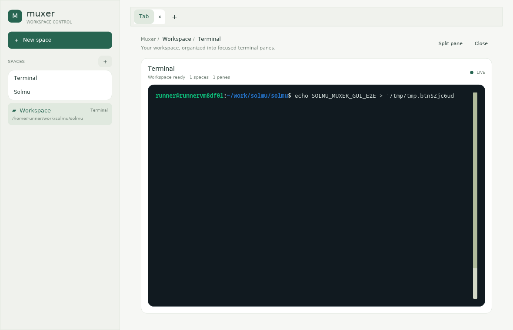
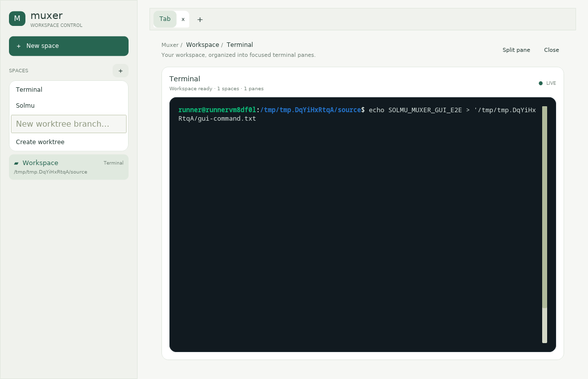
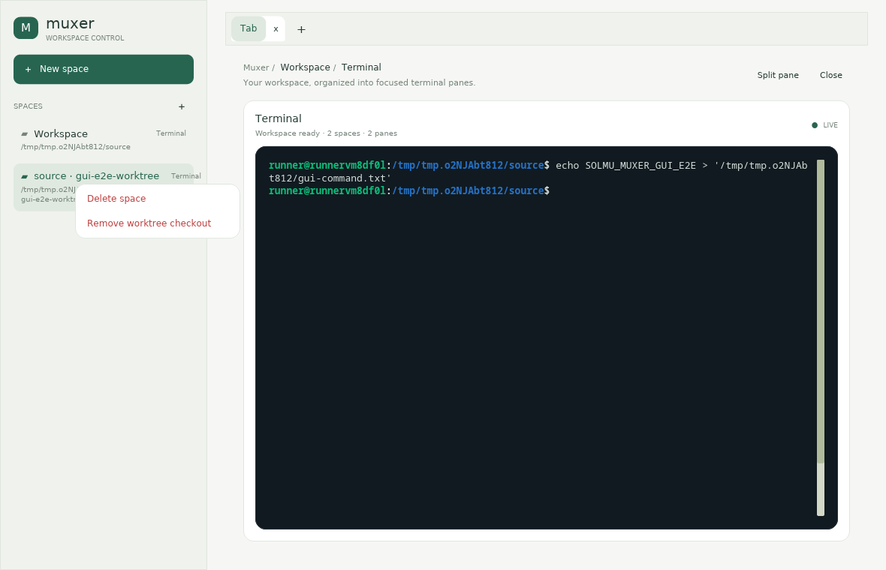
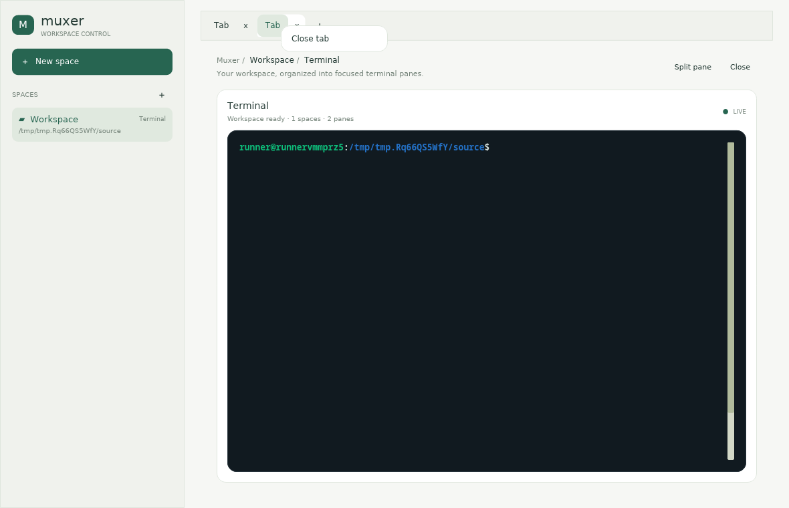
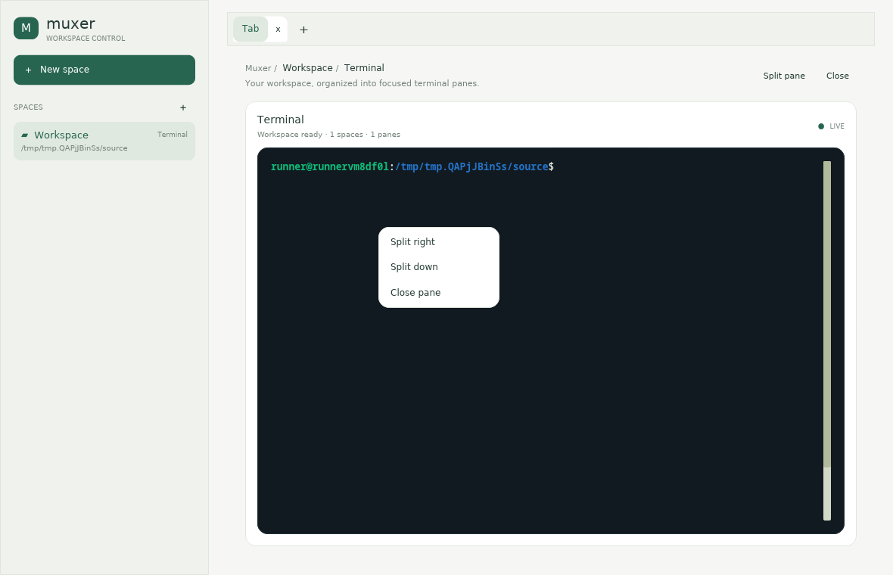

# Solmu Muxer GUI



Muxer GUI is a standalone native workspace app. It embeds the Muxer engine and
shares Muxer's local session files, so you can use the same spaces and tabs
with either app. Only one of the two apps should own a session at a time.

## Install

Linux/macOS:

```sh
curl -fsSL https://raw.githubusercontent.com/panuhorsmalahti/solmu/main/scripts/install-muxer-gui.sh | sh
```

Windows PowerShell:

```powershell
irm https://raw.githubusercontent.com/panuhorsmalahti/solmu/main/scripts/install-muxer-gui.ps1 | iex
```

This installs Muxer GUI and the `solmu` runtime. It does not install or start
the Muxer terminal app. Solmu spaces require the Solmu backend to be running;
Terminal spaces launch local shells. Rerun the install command to update
manually. Automatic daily updates are enabled by default.

## Build locally

From the repository root, build the GUI and its Solmu runtime:

```sh
cargo build --locked -p solmu-cli -p solmu-muxer-gui
```

Then run it from the project folder you want to use as the initial workspace:

```sh
cargo run --locked -p solmu-muxer-gui
```

Start the backend separately if you want to use Solmu spaces. Terminal spaces
work without the backend. The build places `solmu` beside `muxer-gui`, so the
GUI can launch Solmu panes locally.

## Run

```sh
muxer-gui
```

The app opens the local `default` session or creates it from the current
folder. Click **+** beside **Spaces** and choose **Solmu** or **Terminal**.
The left sidebar stays visible in both Solmu and Terminal spaces. Solmu spaces
show Solmu's shared native desktop interface; Terminal spaces show an
interactive shell or another command-line client such as Claude Code. Right-
click a space in the sidebar to delete it, right-click a tab to close it, or
right-click a pane to split or close it. Worktree spaces also have a
**Remove worktree checkout** action, which keeps the branch and refuses dirty
checkouts.

Open **+** beside **Spaces** and enter a branch. Choose **Create worktree**
to add a Git checkout, or **Open worktree** to reopen that branch as a Solmu
space. See the [worktree guide](../docs/muxer-worktrees.md).

Read the [Muxer GUI guide](../docs/muxer-gui.md) and the [Muxer guide](../docs/muxer.md).








