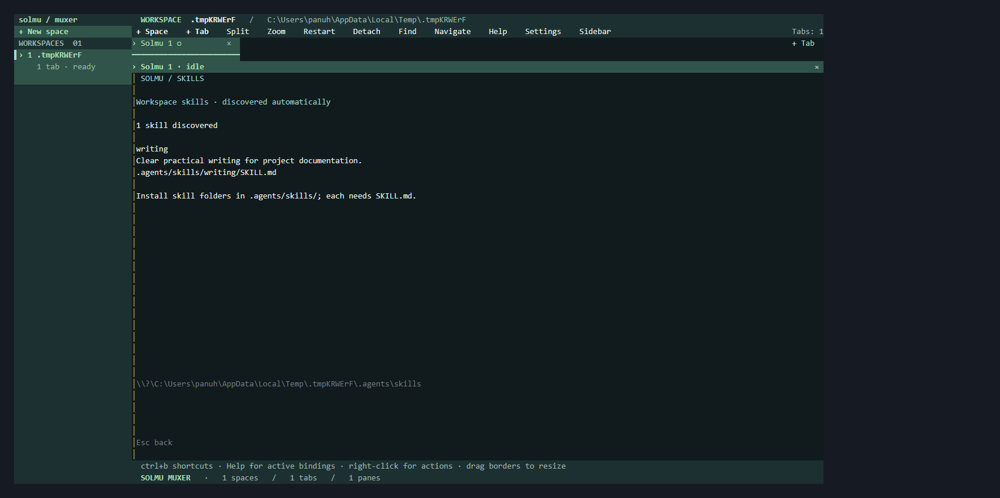
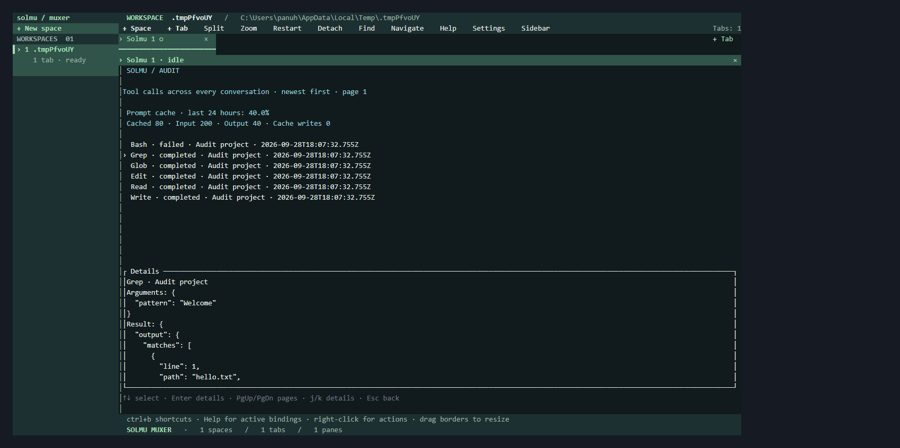
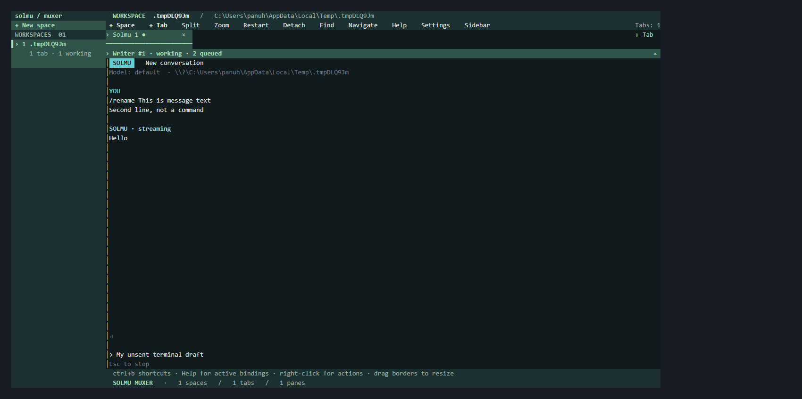
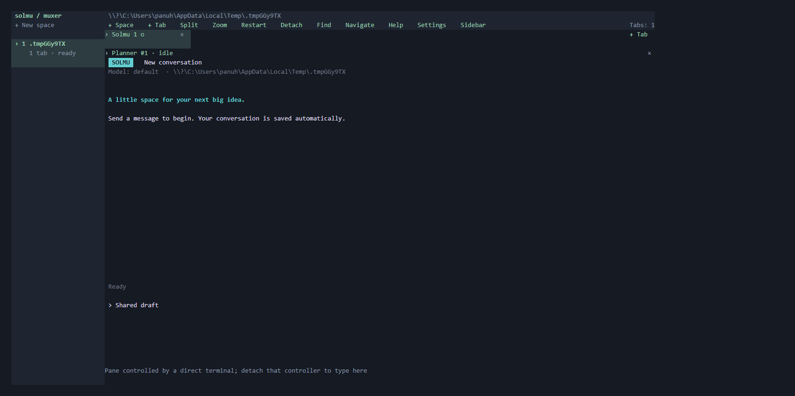
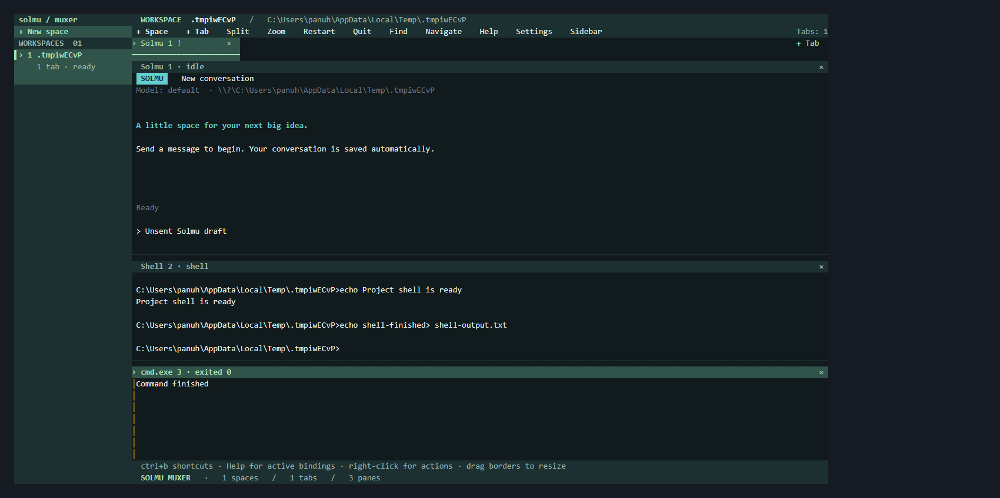
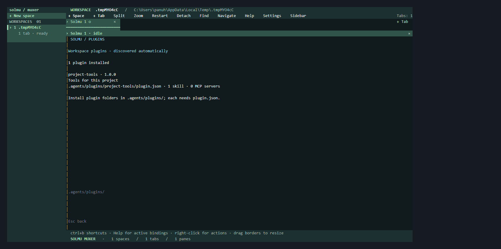
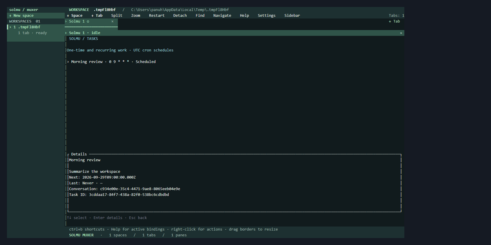

# Solmu muxer

Use `/skills` in a Solmu pane to see automatically discovered
[workspace skills](../docs/skills.md).



A Rust TUI with project spaces and multiple Solmu tabs in each space.
Each tab holds a layout of real terminal panes. Each pane starts its own Solmu
conversation and keeps running while you switch tabs or spaces.
The selected workspace, tab, and pane are highlighted, and the bottom bar
shows shortcuts and layout counts.

## Install

Linux/macOS:

```sh
curl -fsSL https://raw.githubusercontent.com/panuhorsmalahti/solmu/main/scripts/install-muxer.sh | sh
```

Windows PowerShell:

```powershell
irm https://raw.githubusercontent.com/panuhorsmalahti/solmu/main/scripts/install-muxer.ps1 | iex
```

Installs `muxer` and its required `solmu` runtime from the latest release.
Use an existing backend, or [install it separately](../docs/releases.md#individual-components).

## Run

Assuming the backend is already running and the installed commands are on PATH:

```sh
muxer
```

The default backend is `http://127.0.0.1:3000`; set `SOLMU_BACKEND_URL` to connect elsewhere.

Click **+ Space** to choose a project and **+ Tab** to add a session. Select
spaces in the sidebar and tabs along the top; **×** closes a tab. Each space
remembers its selected tab. Split panes right or down, zoom the focused pane,
and drag dividers to resize. Right-click a pane for its action menu.
Right-click spaces, tabs, or panes to rename them; names survive restarts.
**Find** searches names, paths, and statuses across the session. **Navigate**
lets you move without a prefix until Enter or Esc; **Help** lists shortcuts
and filters as you type. These controls also have **Ctrl+b g**, **m**, and **?**
shortcuts. Naming and search fields support Unicode cursor editing and paste.
**Settings** customizes shortcuts, themes, sidebar width, and working-directory
policies. Changes apply automatically, including edits to `config.toml`.
Read [Muxer settings](../docs/muxer-configuration.md) for examples.
Scripts can inspect sessions, create and arrange panes, send terminal input,
and read live screens through the [local automation commands](../docs/muxer-automation.md).
Event streams report live changes; waits observe pane states or matching output.
[Native prompt commands](../docs/muxer-agents.md) send messages without typing
into the active screen, queue tasks in order, and wait for their saved replies.
Stop cancels active and queued work while terminal and Profile drafts stay intact.

Keep an interactive shell or project command beside Solmu: **Ctrl+b t** opens
a shell pane, and **Ctrl+b !** opens the command form. Both actions are also in
the pane's context menu. Commands retain their output after exit and wait for
an explicit restart after the server restarts. [Shells and commands](../docs/muxer-commands.md).

[Direct terminal attachment](../docs/muxer-terminals.md) opens one existing pane or
streams its live screen to scripts. Several observers can watch while one
controller owns input and size, with explicit takeover and draft-preserving detach.
Press **Ctrl+b**, then **n** for a new tab, **Tab** to switch tabs, Up/Down to
switch spaces, **s** to split right, **-** to split down, or **q** to detach.
Use **Ctrl+b h/j/k/l** to focus panes, **H/J/K/L** to swap them, **z** to zoom,
**r** to resize with arrows, and **x** to close a pane. Closing a tab terminates
all its panes; saved conversations remain available.
Muxer runs a local background session: panes and replies keep running when you
detach or close the terminal. Run `muxer` again to reattach, or use
`muxer server stop` to stop the session. `muxer --session work` selects a named
session; `muxer session list` lists running sessions. Use `--foreground` for
a temporary session that ends when you quit.
After a server restart, Muxer restores spaces, tabs, and pane layouts, and
reopens existing Solmu conversations. Pending work stops when the server stops.
See the guide for saved state and recovery backups.
All Solmu conversation commands work inside panes, including `/stop` and `/exit`.

Run `muxer --help` or read the [muxer guide](../docs/muxer.md) for workspace
selection, configuration, shortcuts, and session lifetime.
For source builds, see [development](../docs/development.md).


## Audit

Use `/audit` in a Solmu pane to browse [saved tool calls](../docs/audit.md)
across conversations.









## Workspace tools

Solmu can read, edit, and search files and run Bash commands in the thread's
workspace. Tool activity and results appear live and stay in conversation history.
Stop cancels pending work. See [tools](../docs/tools.md) for usage and limits.

## MCP tools

Use `/mcp` in a Solmu pane to see its servers and tools. [Connect a server](../docs/mcp.md).


## Plugins

Use `/plugins` in a Solmu pane to inspect installed
[Agent Plugins](../docs/plugins.md).



## Scheduled tasks

Use `/tasks` in a Solmu pane to browse scheduled work, and `/task` to manage it.
See [scheduled tasks](../docs/tasks.md).


