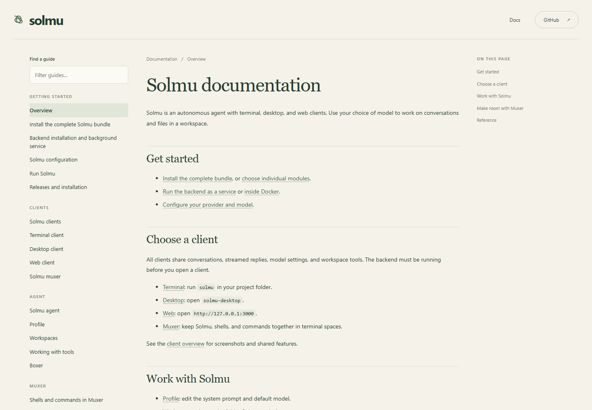

# Solmu website

A concise introduction and documentation for Solmu, hosted at
[panuhorsmalahti.github.io/solmu](https://panuhorsmalahti.github.io/solmu/).

Preview locally from the repository root:

```sh
npm run dev:website
```

Open `http://127.0.0.1:4174`. Choose **Docs** for installation, client, and
workspace guides. The same documentation is published at
[solmu/docs/](https://panuhorsmalahti.github.io/solmu/docs/).

Documentation pages are generated from the root `docs/` Markdown files.
Edit those files to change the guides; every Markdown file is included
automatically. Links between guides, screenshots, tables, code blocks, and
section anchors work on the website. Links to source files and client READMEs
open GitHub.

Build the static website with `npm run build:website`; the output is
`website/dist/`. Local preview builds it when started. Publishing happens
automatically after website or documentation changes reach `main`.



The Pages publishing source in repository settings must be **GitHub Actions**.
